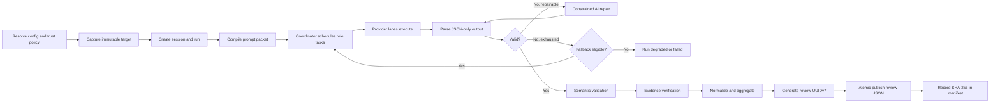

# Mulgae Standalone Review CLI

**Development Specification v1.15.0**
**Date:** 2026-07-28
**Primary binary:** `mulgae`
**Implementation target:** Go

Mulgae is a standalone, help-first CLI for multi-provider, multi-role AI review. It captures an immutable review target, composes role-specific prompt packets, executes provider instances through serialized lanes, validates and repairs structured output, verifies evidence, and publishes a durable review artifact.

Mulgae reports findings and recommendations. It does not grant merge, release, waiver, or organizational approval.
CI is a trusted projection of a committed artifact, not a `review` command mode: `review --ci` and a CI request field are unsupported.

Mulgae roles are functional review lenses.
They are not people, teams, or organizational authorities.
Mulgae reports findings and recommendations only.

## SOT 1.15.0 Contract and Implementation Baseline

This package defines an 84-path/83-payload SOT contract. `CHECKSUMS.sha256` remains cataloged but excluded from its own payload. SOT 1.15.0 preserves G001–G012 as history and closes G013 by ordering the exact release-binary workflow before live family certification. That order exercises Mulgae's bounded Kimi login recovery before the independent capability gate while retaining both layers as mandatory, fail-closed release evidence.

The `plan/` subtree is repository planning authority, not runtime product SOT. It is excluded from `CHECKSUMS.sha256`, the 84-path SOT catalog, runtime defaults, schemas, and release evidence. A plan changes product behavior only after its accepted contract is promoted into the normative SOT; if planning text conflicts with this package, the normative SOT wins.

| Readiness axis | Status |
|---|---|
| Decision | **READY** |
| Implementation | **RELEASE_READY** |
| External contract | **G0 PLATFORM EVIDENCE AND G013 LOGIN-RECOVERING EXACT-BINARY GATE VERIFIED FOR `kimi`, `zcode`, AND `agy`** |

The authority promotion, post-verification `g0_complete`, and separate implementation approval prerequisites were satisfied before product implementation. Historical G008 evidence retained implementation, verification, cleanup, QA, and architecture-review records. Historical G009 integrated-gate evidence remains **HISTORICAL_GATE_PASS_NON_PRODUCTION** with zero recorded P0 blockers. No release assets were authorized or created, and release publication remains subject to separate approval.

Revision 15 keeps `darwin-arm64` as the sole G0 `required`/blocking native platform. G001 completed the G0 support derivation for that platform. `linux-amd64`, `linux-arm64`, and `darwin-amd64` remain `intended_future`, unsupported, and release-ineligible.

Provider and platform evidence v1 remains byte-identical compatibility-only input. G001 completed the required v2 G0 readiness conjunction for exactly `kimi`, `zcode`, and `agy`; that G0 family qualification evidence remains separate from current runtime support. G007 provides adapters for those families with direct noninteractive profiles, strict output isolation, process bounds and cancellation, runtime-capability validation, strict rejection of unlisted families, and provider CLI reporting. A configured `kimi`, `zcode`, or `agy` instance is supported when its family and runtime capability contract are satisfied; user version pins, executable paths, SHA allowlists, and profiles are diagnostic provenance for issue reports and reproducibility, never general runtime authorization. Unknown or new versions are not denied solely for identity. Capability failures produce actionable typed diagnostics, and known incompatibilities may be explicitly blocked. No automatic provider substitution occurs. Historical G008 evidence covers fake/offline root/followup/delta/rerun lineage and P2 publication proof, raw and repaired attempt artifacts, runtime target and prompt inventories, retention/tombstone cleanup, and redacted secure export; it is not production root-review proof. The retained controlled Kimi tuple receipt is historical qualification evidence, not a current support boundary.

Current independent oracles are: product commands **17**; canonical probe argv **4**; SOT catalog/checksummed payload **84/83**; and schema/example relationships **27**.


## Canonical Artifact Contract

A validated review is published at:

```text
.mulgae/{session_id}/{run_id}/review_{uuidv7}.json
```

Example:

```text
.mulgae/s_019f596a-cf80-7c67-b265-f37053d51ccf/
     r_019f596a-cfe4-7c9c-b82e-7149158243ba/
     review_019f596a-d174-7321-b920-c2d312c82cc2.json
```

The file is created only after deterministic schema, semantic, and evidence validation succeeds for all included content. Invalid candidates and AI repair attempts remain under `attempts/` and are never published as a top-level review artifact. A committed artifact may carry `coverage_status=incomplete` when required role coverage could not be obtained while retaining valid `content_verdict`; that condition remains an operational failure for CI.

## Core Invariants

1. Review targets, project context, project-controlled prompts, and provider output are untrusted inputs.
2. Project configuration cannot introduce executable provider commands by default.
3. Provider execution has no live project filesystem access.
4. A provider returns JSON only. Mulgae owns normalization, identifiers, the four final outcome axes, and publication.
5. Missing AI-owned mandatory values may receive one constrained repair attempt. System-owned fields are never delegated to AI.
6. Fallback is triggered only by explicitly classified provider availability, execution, or invalid-output failures.
7. Security violations, configuration violations, user cancellation, artifact failures, and Mulgae internal errors do not trigger fallback.
8. Completed runs and published review artifacts are immutable.
9. A completed run has at most one top-level `review_*.json` artifact.
10. UUIDv7 provides identity and approximate time ordering. SHA-256 recorded in `manifest.json` provides integrity.
11. Aggregated results are not called consensus unless multiple independent providers review the same role under an explicit comparison strategy.
12. `review`, `followup`, `delta`, and `rerun` create distinct runs and answer distinct questions.
13. After session and run identity allocation, runtime diagnostics open before provider spawn and finalize on every terminal path.
14. Runtime JSONL, provider stdout, and provider stderr remain separate; diagnostics never grant publication, CI, approval, cleanup, or release authority.

## End-to-End Flow



## Document Map

| Document | Purpose |
|---|---|
| [Product Contract](docs/01-product-contract.md) | Product purpose, boundaries, roles, and non-negotiable behavior |
| [Domain and State Model](docs/02-domain-and-state-model.md) | Sessions, runs, attempts, findings, state machines, and four-axis outcome computation |
| [CLI Workflows](docs/03-cli-workflows.md) | Command surface and exact semantics for review, followup, delta, and rerun |
| [Configuration](docs/04-configuration.md) | Trust-aware layering, provider instances, merge rules, and examples |
| [Provider Runtime and Scheduling](docs/05-provider-runtime-and-scheduling.md) | Coordinator, lanes, process execution, isolation, cancellation, and fallback |
| [Prompt Contract](docs/06-prompt-contract.md) | Prompt layers, objective linting, target framing, and prompt provenance |
| [Output Validation and Repair](docs/07-output-validation-and-repair.md) | Mandatory keys, JSON schemas, semantic checks, evidence checks, and constrained repair |
| [Artifacts, Lineage, and Storage](docs/08-artifacts-lineage-and-storage.md) | Canonical directory tree, UUIDv7 policy, atomic publication, hashes, and retention |
| [Security and Trust Model](docs/09-security-and-trust.md) | Threat model, trust hierarchy, secret handling, and fail-closed rules |
| [Reporting, CI, and Exit Codes](docs/10-reporting-ci-and-exit-codes.md) | Human reports, machine contracts, coverage policy, CI behavior, and exit codes |
| [Go Architecture](docs/11-go-architecture.md) | Domain-first package layout, ports, adapters, and coordinator responsibilities |
| [Testing Strategy](docs/12-testing-strategy.md) | Unit, property, integration, concurrency, security, and acceptance testing |
| [Delivery Roadmap](docs/13-delivery-roadmap.md) | Implementation sequence, gates, deliverables, and v0.1 definition of done |
| [Decision Log and Verification Items](docs/14-decision-log.md) | Accepted design decisions and the small set of provider-specific items to verify |
| [Glossary](docs/15-glossary.md) | Canonical terminology used throughout the specification |
| [Mandatory Field and Ownership Matrix](docs/16-field-ownership-matrix.md) | Field-by-field ownership, required-value, repair, and publication rules |
| [Superseded Authority Ledger](docs/17-superseded-authority-ledger.md) | Historical configuration and readiness language that is no longer runtime authority |
| [Implementation Checklist](IMPLEMENTATION_CHECKLIST.md) | Historical G001–G012 evidence and the current G013 implementation ledger |

## Machine-Readable Contracts

All schemas use JSON Schema Draft 2020-12. Mulgae embeds one v1 contract
for each supported document and does not carry superseded compatibility
schemas.

| Contract | File |
|---|---|
| Provider review output | [mulgae-provider-review-output.v1.schema.json](schemas/mulgae-provider-review-output.v1.schema.json) |
| Provider review wire | [mulgae-provider-review-wire.v1.schema.json](schemas/mulgae-provider-review-wire.v1.schema.json) |
| Provider followup output | [mulgae-provider-followup-output.v1.schema.json](schemas/mulgae-provider-followup-output.v1.schema.json) |
| Final review artifact | [mulgae-review-artifact.v1.schema.json](schemas/mulgae-review-artifact.v1.schema.json) |
| Run manifest | [mulgae-run-manifest.v1.schema.json](schemas/mulgae-run-manifest.v1.schema.json) |
| Validation result | [mulgae-validation-result.v1.schema.json](schemas/mulgae-validation-result.v1.schema.json) |
| Validation receipt | [mulgae-validation-receipt.v1.schema.json](schemas/mulgae-validation-receipt.v1.schema.json) |
| Repair request | [mulgae-repair-request.v1.schema.json](schemas/mulgae-repair-request.v1.schema.json) |
| Repair patch | [mulgae-repair-patch.v1.schema.json](schemas/mulgae-repair-patch.v1.schema.json) |
| Command result envelope | [mulgae-command-result.v1.schema.json](schemas/mulgae-command-result.v1.schema.json) |
| Project-local doctor result | [mulgae-doctor-result.v1.schema.json](schemas/mulgae-doctor-result.v1.schema.json) |
| Clean plan | [mulgae-clean-plan.v1.schema.json](schemas/mulgae-clean-plan.v1.schema.json) |
| Export manifest | [mulgae-export-manifest.v1.schema.json](schemas/mulgae-export-manifest.v1.schema.json) |
| G0 file catalog | [mulgae-g0-file-catalog.v1.schema.json](schemas/mulgae-g0-file-catalog.v1.schema.json) |
| Provider contract evidence | [mulgae-provider-contract-evidence.v1.schema.json](schemas/mulgae-provider-contract-evidence.v1.schema.json) |
| Platform contract evidence | [mulgae-platform-contract-evidence.v1.schema.json](schemas/mulgae-platform-contract-evidence.v1.schema.json) |
See [schemas/README.md](schemas/README.md) for validation responsibilities and the distinction between JSON Schema checks and semantic checks.

## Examples

| Example | File |
|---|---|
| Project-local operator configuration | [local-config.yaml](examples/local-config.yaml) |
| Valid provider review output | [provider-review-output.v1.valid.json](examples/provider-review-output.v1.valid.json) |
| Valid provider review wire | [provider-review-wire.v1.valid.json](examples/provider-review-wire.v1.valid.json) |
| Valid provider followup output | [provider-followup-output.v1.valid.json](examples/provider-followup-output.v1.valid.json) |
| Repair request | [repair-request.json](examples/repair-request.json) |
| Repair patch | [repair-patch.json](examples/repair-patch.json) |
| Valid final artifact | [review-artifact.v1.valid.json](examples/review-artifact.v1.valid.json) |
| Valid run manifest | [run-manifest.v1.valid.json](examples/run-manifest.v1.valid.json) |
| Valid validation result | [validation-result.v1.valid.json](examples/validation-result.v1.valid.json) |
| Validation receipt | [validation-receipt.v1.valid.json](examples/validation-receipt.v1.valid.json) |
| Command result envelope | [command-result.v1.valid.json](examples/command-result.v1.valid.json) |
| Project-local doctor result | [doctor-result.v1.valid.json](examples/doctor-result.v1.valid.json) |
| Clean plan | [clean-plan.v1.valid.json](examples/clean-plan.v1.valid.json) |
| Export manifest | [export-manifest.v1.valid.json](examples/export-manifest.v1.valid.json) |
| G0 file catalog | [g0-file-catalog.v1.valid.json](examples/g0-file-catalog.v1.valid.json) |
| Provider contract evidence | [provider-contract-evidence.v1.valid.json](examples/provider-contract-evidence.v1.valid.json) |
| Platform contract evidence | [platform-contract-evidence.v1.valid.json](examples/platform-contract-evidence.v1.valid.json) |
| Canonical artifact tree | [artifact-tree.txt](examples/artifact-tree.txt) |

## Minimal User Workflow

```bash
mulgae init
mulgae doctor
mulgae review --diff origin/main...HEAD \
  --objective "Review this change before merge."
mulgae report --run r_019f596a-cf80-7c67-b265-f37053d51ccf \
  --output-path reports/review.md --output json
mulgae findings --run r_019f596a-cf80-7c67-b265-f37053d51ccf \
  --severity high --output json
```

A remediation check creates a new run in the same session:

```bash
mulgae followup --run latest --finding F001 --dirty \
  --objective "Verify only whether the original issue is resolved."
```

## Recorded Implementation Progress

The repository records historical G001–G012 evidence. G013 is **RELEASE_READY** after correcting the release-blocking order that let an expired Kimi session stop the gate before Mulgae's own login recovery could run. The sole gate now executes the exact-binary root/child workflow first and then requires all retained family capability certifications on the same invocation.

| Goal | Scope | Status | Repository marker |
|---|---|---|---|
| G001 | Authority promotion, post-verification, `g0_complete`, SOT baseline | **HISTORICAL — COMPLETE** | `1439c3d` |
| G002 | Domain and ports foundation | **HISTORICAL — COMPLETE** | `64ac360` |
| G003 | Trusted adapters, embedded contracts, foundation CLI | **HISTORICAL — COMPLETE** | `905030c` |
| G004 | Prompt validation, bounded repair, fake review slice | **HISTORICAL — COMPLETE** | `f8eaa89` |
| G005 | Coordinator lanes, direct process runtime, evidence, independent outcome axes | **HISTORICAL — COMPLETE** | `da1939f` |
| G006 | Publication recovery, reporting, query commands | **HISTORICAL — COMPLETE** | `feat(g006)` |
| G007 | Provider adapters for supported families `kimi`, `zcode`, and `agy`; direct noninteractive profiles, isolated output, bounded/cancellable processes, runtime-capability diagnostics, provenance capture, unlisted-family rejection, and provider CLI reporting | **HISTORICAL — COMPLETE** | `feat(g007)` |
| G008 | Fake/offline root/followup/delta/rerun lineage and P2 publication proof; not production root review | **HISTORICAL — COMPLETE** | `feat(g008)` |
| G009 | Historical integrated v0.1 gate; no release publication | **REOPENED_PRODUCTION_REVIEW_INCOMPLETE** | **HISTORICAL_GATE_PASS_NON_PRODUCTION** |
| G010 | Config v1 assignments, configured fallback, production child workflows, and historical real-provider full-workflow gate | **HISTORICAL — COMPLETE** | `g010` |
| G011 | Corrected deterministic acceptance and live provider-family certification under the sole `make test` gate | **RELEASE_READY** | `g011` |
| G012 | Restore exact release-binary actual-provider root/child workflow coverage while retaining family capability certification | **RELEASE_READY** | `g012` |
| G013 | Exercise production Kimi login recovery before fail-closed family capability certification | **RELEASE_READY** | `g013` |

The controlled Kimi qualification receipt records `kimi/local-default/0.23.6/50c3582a1beeba081271193b74efc39c51b3a0a16b4bf32b754b9482a86a314a/kimi-default`, with a retained ledger receipt and local receipt SHA-256 `1227711091fc94aff32dfed18d34f009da7404862b1eb63d99a2313a30c2be27`. Offline standard tests cover the adapter surface. This historical PASS qualifies the recorded run; it neither restricts current family/capability support to that tuple nor requires PASS evidence for every configured tuple.

The controlled provider attempt history is append-only. Two later opt-in retries on 2026-07-18, after that retained PASS, each exited after approximately 30.15 seconds with `status=timeout`, `termination=timed_out`, and `diagnostic=process_timeout`; the durable G009 ledger records both outcomes. Those external liveness retries do not erase the earlier PASS or alter current support policy, but they remain part of the final evidence record.

## Status of Provider Support

G001 established the required G0 provider/platform readiness evidence. G007 supports `kimi`, `zcode`, and `agy` by family identity and runtime capability contract; version, path, SHA, and profile remain recorded diagnostic provenance rather than authorization gates. `codex`, `claude`, and every unlisted family remain rejected, disabled, non-default, and ineligible for automatic fallback. Future platforms remain unsupported and release-ineligible.
