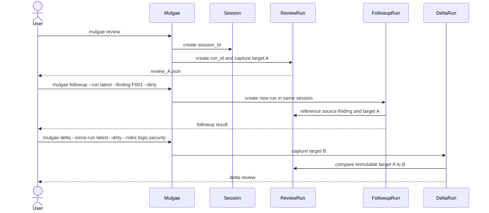

# CLI Workflows

## 1. Command Surface

```text
mulgae init
mulgae doctor
mulgae review
mulgae followup
mulgae delta
mulgae rerun
mulgae status
mulgae report
mulgae findings
mulgae excerpt
mulgae providers
mulgae config
mulgae schema
mulgae clean
mulgae export
mulgae help
```

## 2. Run-Creation Semantics
This section specifies the production command contract. Production root `mulgae review` is implemented and release-ready under G013 after the exact release binary completed actual-provider root and child workflows before the fail-closed family capability suite. Deterministic integration tests own product semantics, while executable workflow and live capability coverage verify the composition and native boundaries through the sole `make test` gate.

| Command | Main question | Prior run required | Target basis | Creates a new run |
|---|---|---:|---|---:|
| `review` | What issues exist in this new scope? | No | Full captured target | Yes |
| `followup` | Is a referenced finding resolved? | Yes | Current target plus source finding | Yes |
| `delta` | What issues exist only in changes since a prior reviewed snapshot? | Yes | Previous immutable snapshot to current snapshot | Yes |
| `rerun` | Can an attempt be repeated after instability or invalid output? | Yes | Exact or recomposed source scope | Yes |
## 2.1 Complete 17-command contract

The command-result envelope is `https://mulgae.local/schemas/mulgae-command-result.v1.schema.json`. Every machine-output request variant is its literal `#/$defs/requests/<command>` pointer; provider-output schemas are never command requests. The frozen v1 schema has no truthful request variant for `schema list`, so `mulgae schema list --output json` fails closed as usage rather than fabricating an inspection envelope. Human `mulgae schema list` remains available; JSON `schema show` and `schema export` return the command-result envelope. Typed exits are exhaustive for the command surface: policy `1`, usage/configuration `2`, readiness/coverage `4`, artifact/evidence/publication/stale `7`, security `8`, cancellation `9`, and internal invariant `10`.
G008 implements the frozen request contract and its two-phase boundary: CLI-only selectors are resolved and valueless stdin is captured before the schema-valid request is frozen. The frozen request contains canonical IDs and canonical target values only; it never contains `latest`, a role/provider rerun selector, or uncaptured stdin.

| Command | Owner / service | Required reads → writes | Primary output contracts | Typed exits |
|---|---|---|---|---|
| `init` | `internal/app/init` / `InitializeProject` | installed-user identity and provider discovery → sole project-local `.mulgae/config.yaml` | command result | 2, 4, 7, 8, 9, 10 |
| `doctor` | `internal/app/doctor` / `DiagnoseEnvironment` | config, binaries, provider/platform evidence → redacted diagnostic | doctor result, command result | 2, 4, 7, 8, 9 |
| `review` | `internal/app/review` / `StartReviewRun` | target, resolved policy → run, prompts, attempts, final, epoch | run manifest v2, review artifact v2 | 1, 2, 4, 7, 8, 9, 10 |
| `followup` | `internal/app/followup` / `StartFollowupRun` | source run/review/finding and target → child run and final | provider followup output v2, run manifest v2, review artifact v2 | 1, 2, 4, 7, 8, 9, 10 |
| `delta` | `internal/app/delta` / `StartDeltaRun` | source and current targets/runs → child artifacts | run manifest v2, review artifact v2 | 1, 2, 4, 7, 8, 9, 10 |
| `rerun` | `internal/app/rerun` / `StartRerun` | source run and prompt → exact or recomposed child artifacts | run manifest v2, review artifact v2 | 1, 2, 4, 7, 8, 9, 10 |
| `status` | `internal/app/query` / `ReadRunStatus` | manifest, epoch, diagnostics → none | run manifest v2 | 2, 7, 8, 9, 10 |
| `report` | `internal/app/report` / `RenderReport` | committed review and evidence → `report.md` | command result | 2, 7, 8, 9, 10 |
| `findings` | `internal/app/query` / `ListFindings` | review → none | review artifact v2 | 2, 7, 8, 9, 10 |
| `excerpt` | `internal/app/query` / `RenderExcerpt` | target, review, evidence → none | command result | 2, 4, 7, 8, 9, 10 |
| `providers` | `internal/app/providers` / `ListProviderProfiles` | config and provider evidence → none | provider-contract evidence v1 | 2, 4, 7, 8 |
| `roles` | `internal/app/roles` / `ListRoles` | embedded role inventory → none | command result | 2 |
| `config` | `internal/app/config` / `ResolveConfiguration` | attested project-local `.mulgae/config.yaml` → resolved policy | command result | 2, 4, 7, 8, 9, 10 |
| `schema` | `internal/app/schema` / `InspectSchema` | embedded schemas → optional export | command result | 2, 7 |
| `clean` | `internal/app/clean` / `PlanAndApplyRetention` | manifests, edges, epoch → plan, tombstone, deletion receipt | clean plan v1 | 2, 7, 8 |
| `export` | `internal/app/export` / `ExportRedactedRun` | immutable run and review → secure bundle and manifest | export manifest v1 | 2, 7, 8 |
| `help` | `internal/app/help` / `RenderHelp` | embedded docs → none | command result | 2 |

Init captures PATH and optional `KIMI_CODE_HOME` once at process startup. It
observes only explicitly selected families; an unselected family performs zero
executable, launcher, or environment reads. Completed discovery always emits
the fixed Kimi, ZCode, and AGY rows. In auto mode, an ordinarily unavailable
family does not suppress another valid candidate, while any security failure
retains security precedence after the three rows are assembled.

The exact init selection grammar is
`--providers auto|FAMILY[,FAMILY...]`, where `FAMILY := kimi | zcode | agy`,
plus optional `--roles ROLE[,ROLE...]` and `--project-kind non_ui|ui`.
Omitting `--roles` selects only `logic`; init has no interview mode. An explicit
role list is canonicalized to fixed order and `logic` is added when omitted.
UI init may select `artist` and then accepts `--artist-brief PATH` and
`--artist-design-specs GLOB[,GLOB...]`; UI projects do not select artist
automatically. The default brief path is `ux-ui-info.md`. The resulting project
role set contains one to seven unique roles and must contain `logic`; artist is
valid only with `project-kind=ui`.
It accepts each of the seven nonempty family subsets and canonicalizes request,
result, and configuration order to Kimi, ZCode, AGY. Empty tokens, whitespace,
unknown or duplicate families, and mixing `auto` with a family are usage
errors. When an invalid init argv still unambiguously requests `--output json`,
Mulgae emits the rejected request
`{request_id,command:"init",request_state:"invalid",output_format:"json"}`
with `init_selection_invalid` at exit `2`; it does not fabricate accepted
selection or path fields.

The literal non-command output URIs are `https://mulgae.local/schemas/mulgae-doctor-result.v1.schema.json`, `https://mulgae.local/schemas/mulgae-run-manifest.v1.schema.json`, `https://mulgae.local/schemas/mulgae-review-artifact.v1.schema.json`, `https://mulgae.local/schemas/mulgae-provider-followup-output.v1.schema.json`, `https://mulgae.local/schemas/mulgae-provider-contract-evidence.v1.schema.json`, `https://mulgae.local/schemas/mulgae-clean-plan.v1.schema.json`, and `https://mulgae.local/schemas/mulgae-export-manifest.v1.schema.json`. A command's response must retain independent content, coverage, publication, and CI outcomes rather than synthesizing one verdict.
`help` is intentionally repository-independent. It renders only embedded documentation, reads no project configuration, and remains available in non-Git and unborn directories without locality attestation.
For G006, successful `status` results include the durable `recovery_action` and expose `final_artifact_uri` only for a validated P2 commit; errored status results retain the selected `run_id` but use null authority fields. Successful JSON `excerpt` results carry the exact verified bytes as canonical RFC 4648 `excerpt_base64` plus `excerpt_sha256`, where the digest is computed over the decoded transport bytes; non-verified results carry neither. Nonzero `status`, `report`, `findings`, and `excerpt` results use the explicit `status_failed`, `report_failed`, `findings_failed`, and `excerpt_failed` kinds. Report output validation rejects case aliases of `.mulgae`, `.git`, `.gjc`, and Mulgae-owned root configuration names before any publication lookup.

## 2.2 Gate and readiness semantics

`init` records all configured intended provider IDs with `status=unverified` when evidence is unavailable. It must neither silently disable nor substitute them; `doctor` is required before review readiness can be claimed. `doctor`, `providers`, and `status` expose `PASS`, `FAIL`, or `INCONCLUSIVE` evidence without promoting it. `INCONCLUSIVE` is not PASS.
`doctor` emits `mulgae-doctor-result.v1` inline and never persists diagnostics. It reports the fixed Kimi/ZCode/AGY inventory, project-local config admission, assignment resilience, and readiness. Singleton eligibility is `degraded` at exit `0`; missing or unavailable primaries are `unverified` at exit `4`; locality or identity violations are `unsafe` at exit `8`. Human and JSON output are ANSI-free.
A pure native-home observation cancellation aborts `init`, `config`, or `doctor`
at exit `9` with `request_cancelled`. Init does not mutate, config exposes no
accepted digest, and doctor emits no partial doctor artifact. A separately
observed security or artifact failure retains its higher precedence.

No command, including `init`, `doctor`, or `schema`, authorizes product implementation, authority-ref mutation, or `g0_complete`. Those actions require the separate session-bound G0 approval DAG.

## 3. `mulgae review`

Specifies the composed independent review operation. G013 production verification is complete after the login-recovering exact-binary live workflow and subsequent family capability suite passed; current qualification, execution, validation, cleanup, and P2 publication still fail closed per invocation when their runtime authority is unavailable.

```bash
mulgae review --diff origin/main...HEAD \
  --objective "Review this change before merge."
```

```bash
mulgae review --dirty \
  --roles logic,security,testing
```

```bash
cat change.patch | mulgae review --stdin \
  --objective "Focus on fallback state transitions."
```

An artist review may bind its UX/UI inputs to that review instead of changing
project configuration:

```bash
mulgae review --dirty \
  --roles artist \
  --artist-brief docs/roadmap.md \
  --artist-design-specs "design-specs/**/*.png,design-specs/**/*.webp"
```

Semantics:

- resolves symbolic Git refs to immutable object IDs at run start;
- captures valueless `--stdin` through the resolver before constructing the canonical `target={kind:"stdin",value:...}` request value;
- captures the target before provider execution;
- creates a new session unless `--session` is explicitly provided for an imported workflow;
- does not inherit findings from another run;
- with no `--roles`, selects every role enabled by project configuration;
- with explicit `--roles`, selects exactly that nonempty enabled subset without automatically adding `logic`, `security`, or `review.required_roles`;
- resolves `--artist-brief` and `--artist-design-specs` independently over the
  corresponding Config v1 artist input; an omitted review flag uses its
  configured fallback;
- accepts artist input flags only when the review selects artist, and requires
  both a nonempty UTF-8 brief and at least one matched PNG/JPEG/WebP visual
  before any provider invocation;
- never reads or sends artist brief or visual inputs when artist is not selected;
- publishes at most one final review artifact.
- preserves immutable captured target bytes; native `@file` transport, when selected, refers only to that captured material and never weakens the no-live-root or no-`HOME` boundary.

## 4. `mulgae followup`

Evaluates one prior finding.

```bash
mulgae followup --run latest --finding F_SOURCE-1 --stdin \
  --objective "Verify only whether the original issue is resolved."
```

Optional role targeting:

```bash
mulgae followup --run r_019f596a-cf80-7c67-b265-f37053d51ccf --finding F003 --dirty \
  --role logic
```

Semantics:

- requires a valid source run and finding reference;
- includes the original finding, verified evidence, and current target context;
- returns `resolved`, `partially_resolved`, `still_open`, or `unclear`;
- does not replace or mutate the original finding;
- may report a newly introduced blocker, but does not silently become a broad review.

## 5. `mulgae delta`

Reviews the difference between immutable target snapshots.

```bash
mulgae delta --since-run latest --dirty --roles logic,security
```

Delta is defined as:

```text
source run target snapshot -> newly captured target snapshot
```

It is not defined as a comparison of ref names or only two patch hashes. The source run must contain sufficient immutable target metadata.
`--since-run` is the source selector. Its `latest` form resolves to a canonical `source_run_id` before the delta request is frozen; the frozen request has no selector field.

Rules:

- old findings are background only;
- delta does not prove old findings were fixed;
- if the source target cannot be reconstructed, the command fails with a target error;
- stdin-only reviews support delta only if Mulgae materialized a comparable snapshot representation.

## 6. `mulgae rerun`

Repeats an attempt without mutating the source run.

```bash
mulgae rerun --run latest --role documentation --provider kimi-main
```

Replay modes:

| Mode | Behavior |
|---|---|
| `exact` | Reuses captured target bytes, composed prompt bytes, resolved adapter profile, and source attempt parameters |
| `recompose` | Reuses the target but composes a new prompt using current trusted templates and configuration |
A rerun accepts either `--attempt <attempt-id>` or exactly one `--role <role> --provider <provider>` selector. In the latter form, Mulgae resolves the run selector first and then resolves the role/provider pair to one canonical source attempt before freezing the request; the frozen request contains `source_run_id` and `source_attempt_id`, not the selector pair.

Default:

```text
mulgae rerun --run latest --attempt a_019f596a-cf80-7c67-b265-f37053d51ccf --replay exact
```

`rerun` is for timeout, provider instability, invalid JSON, or other execution-quality problems. A code change intended to resolve a finding should use `followup` or `delta`.

## 7. Target Selection

Supported target inputs:

```text
--workspace
--stage
--dirty
--diff <base>
--diff <base>..<head>
--diff <base>...<head>
--patch <path>
--stdin
```

Exactly one target input is required. `--workspace`, `--stage`, and `--dirty`
are valueless. `--diff git` is not accepted.

- `--workspace` captures every eligible project text file without requiring a
  Git repository. `.git/` and `.mulgae/` are always excluded; `.gitignore` and
  `.mulgaeignore` form independent exclusion sets.
- `--stage` captures `HEAD` to the current index and exposes current evidence
  through side `index`.
- `--dirty` captures `HEAD` to the worktree, including staged, unstaged, and
  non-ignored untracked files; current evidence uses side `worktree`.
- `--diff A` compares commit A to the captured index, `A..B` compares the two
  endpoint trees, and `A...B` follows Git semantics by comparing the merge base
  of A and B to B.
- A project without Git can use only `--workspace`. A Git repository without a
  first commit must also use `--workspace` rather than `--stage` or `--dirty`.

`--stdin` is valueless at the CLI boundary. Mulgae captures it before canonical target creation; the frozen request records the resulting nonempty canonical stdin target value.

For Git targets, Mulgae captures:

- repository identity;
- base object ID;
- head object ID;
- head tree object ID;
- index tree object ID when applicable;
- staged and unstaged patch bytes according to selected mode;
- untracked manifest when explicitly included;
- canonical target SHA-256.

The root `.mulgaeignore` uses Git-ignore pattern syntax and applies to workspace,
stage, dirty, and commit diff targets, including tracked files. Eligible
symlinks, special files, non-UTF-8 files, and bounded-size violations fail with
an explicit path instead of being silently omitted.

Mulgae publishes a captured-review archive beside the target bytes. The run
support index digest-binds its materialized workspace and evidence sides.
Rerun reconstructs from that archive instead of recapturing the checkout;
followup preserves the newly captured archive, and delta compares the source
and current archived file sets. Child workflows therefore remain stable after
the original worktree, index, or branch changes.

Mulgae never stores only a mutable ref such as `origin/main` as the source of truth.

## 8. `latest` Resolution

`latest` is scoped to the current project root and artifact root.
`latest` is a CLI selector, not a request value. Mulgae resolves it before request freezing for every command that accepts it, including `--since-run` for `delta`, `--run` for `followup`, `rerun`, and `export`.

Resolution order:

1. valid session and run directories only;
2. `created_at` from run manifests;
3. run UUIDv7 as a stable tiebreaker.

A corrupt or incomplete manifest is skipped with a diagnostic. Directory modification time is not authoritative.

## 9. Typical Lineage



## 10. Artifact Maintenance

```bash
mulgae clean --mode plan
mulgae clean --mode apply --expected-plan-sha256 sha256:bbbbbbbbbbbbbbbbbbbbbbbbbbbbbbbbbbbbbbbbbbbbbbbbbbbbbbbbbbbbbbbb
mulgae export --run latest --output-path exports/mulgae-review.zip --output human
```

`clean` obtains retention age, size thresholds, and explicit keep IDs from resolved policy, not CLI retention flags. `export` requires a safe relative `--output-path`; redaction is unconditional, and `--output` selects only the command-result format (`json` or `human`), never export redaction or destination.

`clean` operates only inside the validated artifact root and never follows symlinks. `export` creates a new secure-writer package and never mutates the source run, grants publication authority, or authorizes release.
`clean` is deterministic. Its resolved-policy inputs are `retention_age`, `min_age_for_size`, `target_bytes`, and explicit keep IDs, plus fixed `now` and store epoch `E0`. The retained seed is explicit keep IDs plus active, uncommitted, corrupt, and newest completed-per-session runs; transitive ancestors are retained, and a graph anomaly protects its reachable component.

It computes `age_delete_set` first from unprotected completed runs older than `now-retention_age`, then `size_delete_set` from remaining unprotected completed runs no newer than `now-min_age_for_size` until regular-file lstat bytes after planned deletion are at most `target_bytes`. Each set sorts by `(completed_at UTC epoch nanoseconds ascending, run_id UTF-8 ascending)`; missing or invalid time is protected. A dry run emits one canonical clean plan with resolved-policy inputs, `E0`, ordered actions, reasons, edge references, byte counts, and plan hash. Apply requires the exact `--expected-plan-sha256`, unchanged `E0`, and unchanged input-policy hash; a stale plan exits `7` without recomputing. Tombstone commit precedes deletion, restart resumes the tombstone, and an unjournaled partial directory is protected as corrupt.

## 11. Help-First Requirements

Required help topics:

```text
mulgae help quickstart
mulgae help config
mulgae help providers
mulgae help lanes
mulgae help prompts
mulgae help workflows
mulgae help artifacts
mulgae help validation
mulgae help ci
mulgae help exit-codes
mulgae help security
```

The machine-stable role inventory is a command, not a help topic: use
`mulgae roles` or `mulgae roles --output json`.

Help must explain:

- functional roles and lack of approval authority;
- serial execution per concurrency key and parallel execution across keys;
- the difference among four run types;
- why a valid negative review does not trigger fallback;
- where final and intermediate artifacts are stored;
- that provider commands require readiness checks and doctor version guidance is not an executable version or SHA authorization gate;
- that targets may be transmitted to remote provider services;
- that project configuration cannot define executable commands by default.

## 12. Required Command Diagnostics

Every user-facing failure should include:

```text
stage
session_id when available
run_id when available
role when applicable
provider instance when applicable
attempt_id when applicable
failure class
whether fallback was attempted or prohibited
artifact path for diagnostics
recommended next command
```
