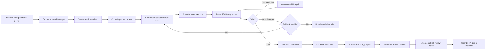

# KAR Standalone Review CLI

**Development Specification v1.1.0**
**Date:** 2026-07-13
**Primary binary:** `kar`
**Implementation target:** Go

KAR is a standalone, help-first CLI for multi-provider, multi-role AI review. It captures an immutable review target, composes role-specific prompt packets, executes provider instances through serialized lanes, validates and repairs structured output, verifies evidence, and publishes a durable review artifact.

KAR reports findings and recommendations. It does not grant merge, release, waiver, or organizational approval.

## SOT 1.1.0 G0 Contract Baseline

This package freezes the SOT 1.1.0 G0 contract. It contains **71 catalog paths** and **70 checksummed regular-file payloads**; `CHECKSUMS.sha256` is cataloged but excluded from its own payload.

| Readiness axis | Status |
|---|---|
| Decision | **READY** |
| Implementation | **CONDITIONAL** |
| External contract | **UNVERIFIED** |

This package is not an approval artifact and does not grant authority promotion, `g0_complete`, product implementation, actual product/release CI jobs, or release assets. They remain prohibited until `g0_complete` and a separate session-bound implementation approval are both recorded.

Revision 13 makes `darwin-arm64` the sole G0 `required`/blocking native platform. The inventory retains `linux-amd64`, `linux-arm64`, and `darwin-amd64` as `intended_future`, non-blocking, unsupported, and release-ineligible; no future cell is a current support or release claim.

Provider and platform evidence v1 remains byte-identical compatibility-only input. Only provider/platform evidence v2 may enter readiness. Provider readiness is the conjunction of all three runtime-order families (`kimi`, `zcode`, `agy`) × all 16 probes (**48 PASS**), three secure-writer indexes (**3 PASS**), and a live assignment receipt (**PASS**); any missing or non-PASS input keeps External Contract Readiness **UNVERIFIED**.

Current independent oracles are: product commands **17**; canonical probe argv **4**; SOT catalog/checksummed payload **71/70**; schema/example relationships **23**; and G0-required pairs **16**. Gate A1 authorizes only the exact SOT-path mutation; it does not grant candidate evidence, promotion, `g0_complete`, implementation, CI, or release authorization.


## Canonical Artifact Contract

A validated review is published at:

```text
.kar/{session_id}/{run_id}/review_{uuidv7}.json
```

Example:

```text
.kar/s_019f596a-cf80-7c67-b265-f37053d51ccf/
     r_019f596a-cfe4-7c9c-b82e-7149158243ba/
     review_019f596a-d174-7321-b920-c2d312c82cc2.json
```

The file is created only after deterministic schema, semantic, and evidence validation succeeds for all included content. Invalid candidates and AI repair attempts remain under `attempts/` and are never published as a top-level review artifact. A committed artifact may carry `coverage_status=incomplete` when required role coverage could not be obtained while retaining valid `content_verdict`; that condition remains an operational failure for CI.

## Core Invariants

1. Review targets, project context, project-controlled prompts, and provider output are untrusted inputs.
2. Project configuration cannot introduce executable provider commands by default.
3. Provider execution has no project filesystem access by default.
4. A provider returns JSON only. KAR owns normalization, identifiers, the four final outcome axes, and publication.
5. Missing AI-owned mandatory values may receive one constrained repair attempt. System-owned fields are never delegated to AI.
6. Fallback is triggered only by explicitly classified provider availability, execution, or invalid-output failures.
7. Security violations, configuration violations, user cancellation, artifact failures, and KAR internal errors do not trigger fallback.
8. Completed runs and published review artifacts are immutable.
9. A completed run has at most one top-level `review_*.json` artifact.
10. UUIDv7 provides identity and approximate time ordering. SHA-256 recorded in `manifest.json` provides integrity.
11. Aggregated results are not called consensus unless multiple independent providers review the same role under an explicit comparison strategy.
12. `review`, `followup`, `delta`, and `rerun` create distinct runs and answer distinct questions.

## End-to-End Flow



## Document Map

| Document | Purpose |
|---|---|
| [Product Contract](docs/01-product-contract.md) | Product purpose, boundaries, roles, and non-negotiable behavior |
| [Domain and State Model](docs/02-domain-and-state-model.md) | Sessions, runs, attempts, findings, state machines, and four-axis outcome computation |
| [CLI Workflows](docs/03-cli-workflows.md) | Command surface and exact semantics for review, followup, delta, and rerun |
| [Configuration](docs/04-configuration.md) | Trust-aware layering, provider instances, merge rules, and examples |
| [Provider Runtime and Scheduling](docs/05-provider-runtime-and-scheduling.md) | Coordinator, lanes, process execution, isolation, cancellation, and fallback |
| [Prompt Contract](docs/06-prompt-contract.md) | Prompt layers, objective linting, target framing, and prompt provenance |
| [Output Validation and Repair](docs/07-output-validation-and-repair.md) | Mandatory keys, JSON schemas, semantic checks, evidence checks, and constrained repair |
| [Artifacts, Lineage, and Storage](docs/08-artifacts-lineage-and-storage.md) | Canonical directory tree, UUIDv7 policy, atomic publication, hashes, and retention |
| [Security and Trust Model](docs/09-security-and-trust.md) | Threat model, trust hierarchy, secret handling, and fail-closed rules |
| [Reporting, CI, and Exit Codes](docs/10-reporting-ci-and-exit-codes.md) | Human reports, machine contracts, coverage policy, CI behavior, and exit codes |
| [Go Architecture](docs/11-go-architecture.md) | Domain-first package layout, ports, adapters, and coordinator responsibilities |
| [Testing Strategy](docs/12-testing-strategy.md) | Unit, property, integration, concurrency, security, and acceptance testing |
| [Delivery Roadmap](docs/13-delivery-roadmap.md) | Implementation sequence, gates, deliverables, and v0.1 definition of done |
| [Decision Log and Verification Items](docs/14-decision-log.md) | Accepted design decisions and the small set of provider-specific items to verify |
| [Glossary](docs/15-glossary.md) | Canonical terminology used throughout the specification |
| [Mandatory Field and Ownership Matrix](docs/16-field-ownership-matrix.md) | Field-by-field ownership, required-value, repair, and publication rules |
| [Implementation Checklist](IMPLEMENTATION_CHECKLIST.md) | Conditional post-G0 implementation gates and handoff checklist |

## Machine-Readable Contracts

All schemas use JSON Schema Draft 2020-12. The v1 contracts remain frozen compatibility contracts; provider/platform v1 evidence is compatibility-only and cannot enter readiness. The v2 contracts and v2 provider/platform evidence define the SOT 1.1.0 baseline and the only readiness authority.

| Contract | File |
|---|---|
| Provider review output v1 | [kar-provider-review-output.v1.schema.json](schemas/kar-provider-review-output.v1.schema.json) |
| Provider review output v2 | [kar-provider-review-output.v2.schema.json](schemas/kar-provider-review-output.v2.schema.json) |
| Provider followup output v1 | [kar-provider-followup-output.v1.schema.json](schemas/kar-provider-followup-output.v1.schema.json) |
| Provider followup output v2 | [kar-provider-followup-output.v2.schema.json](schemas/kar-provider-followup-output.v2.schema.json) |
| Final review artifact v1 | [kar-review-artifact.v1.schema.json](schemas/kar-review-artifact.v1.schema.json) |
| Final review artifact v2 | [kar-review-artifact.v2.schema.json](schemas/kar-review-artifact.v2.schema.json) |
| Run manifest v1 | [kar-run-manifest.v1.schema.json](schemas/kar-run-manifest.v1.schema.json) |
| Run manifest v2 | [kar-run-manifest.v2.schema.json](schemas/kar-run-manifest.v2.schema.json) |
| Validation result v1 | [kar-validation-result.v1.schema.json](schemas/kar-validation-result.v1.schema.json) |
| Validation result v2 | [kar-validation-result.v2.schema.json](schemas/kar-validation-result.v2.schema.json) |
| Validation receipt | [kar-validation-receipt.v1.schema.json](schemas/kar-validation-receipt.v1.schema.json) |
| Repair request | [kar-repair-request.v1.schema.json](schemas/kar-repair-request.v1.schema.json) |
| Repair patch | [kar-repair-patch.v1.schema.json](schemas/kar-repair-patch.v1.schema.json) |
| Prompt manifest | [kar-prompt-manifest.v1.schema.json](schemas/kar-prompt-manifest.v1.schema.json) |
| Command result envelope | [kar-command-result.v1.schema.json](schemas/kar-command-result.v1.schema.json) |
| Doctor result | [kar-doctor-result.v1.schema.json](schemas/kar-doctor-result.v1.schema.json) |
| Clean plan | [kar-clean-plan.v1.schema.json](schemas/kar-clean-plan.v1.schema.json) |
| Export manifest | [kar-export-manifest.v1.schema.json](schemas/kar-export-manifest.v1.schema.json) |
| G0 file catalog | [kar-g0-file-catalog.v1.schema.json](schemas/kar-g0-file-catalog.v1.schema.json) |
| Provider contract evidence v1 (compatibility only) | [kar-provider-contract-evidence.v1.schema.json](schemas/kar-provider-contract-evidence.v1.schema.json) |
| Provider contract evidence v2 (readiness authority) | [kar-provider-contract-evidence.v2.schema.json](schemas/kar-provider-contract-evidence.v2.schema.json) |
| Platform contract evidence v1 (compatibility only) | [kar-platform-contract-evidence.v1.schema.json](schemas/kar-platform-contract-evidence.v1.schema.json) |
| Platform contract evidence v2 (readiness authority) | [kar-platform-contract-evidence.v2.schema.json](schemas/kar-platform-contract-evidence.v2.schema.json) |
See [schemas/README.md](schemas/README.md) for validation responsibilities and the distinction between JSON Schema checks and semantic checks.

## Examples

| Example | File |
|---|---|
| Global user configuration | [global-config.yaml](examples/global-config.yaml) |
| Project configuration | [project-config.yaml](examples/project-config.yaml) |
| Valid provider review output v1 | [provider-review-output.valid.json](examples/provider-review-output.valid.json) |
| Valid provider review output v2 | [provider-review-output.v2.valid.json](examples/provider-review-output.v2.valid.json) |
| Valid provider followup output v1 | [provider-followup-output.valid.json](examples/provider-followup-output.valid.json) |
| Valid provider followup output v2 | [provider-followup-output.v2.valid.json](examples/provider-followup-output.v2.valid.json) |
| Repair request | [repair-request.json](examples/repair-request.json) |
| Repair patch | [repair-patch.json](examples/repair-patch.json) |
| Valid final artifact v1 | [review-artifact.valid.json](examples/review-artifact.valid.json) |
| Valid final artifact v2 | [review-artifact.v2.valid.json](examples/review-artifact.v2.valid.json) |
| Valid run manifest v1 | [run-manifest.valid.json](examples/run-manifest.valid.json) |
| Valid run manifest v2 | [run-manifest.v2.valid.json](examples/run-manifest.v2.valid.json) |
| Valid validation result v1 | [validation-result.valid.json](examples/validation-result.valid.json) |
| Valid validation result v2 | [validation-result.v2.valid.json](examples/validation-result.v2.valid.json) |
| Validation receipt | [validation-receipt.v1.valid.json](examples/validation-receipt.v1.valid.json) |
| Prompt manifest | [prompt-manifest.v1.valid.json](examples/prompt-manifest.v1.valid.json) |
| Command result envelope | [command-result.v1.valid.json](examples/command-result.v1.valid.json) |
| Doctor result | [doctor-result.v1.valid.json](examples/doctor-result.v1.valid.json) |
| Clean plan | [clean-plan.v1.valid.json](examples/clean-plan.v1.valid.json) |
| Export manifest | [export-manifest.v1.valid.json](examples/export-manifest.v1.valid.json) |
| G0 file catalog | [g0-file-catalog.v1.valid.json](examples/g0-file-catalog.v1.valid.json) |
| Provider contract evidence v1 (compatibility only) | [provider-contract-evidence.v1.valid.json](examples/provider-contract-evidence.v1.valid.json) |
| Provider contract evidence v2 | [provider-contract-evidence.v2.valid.json](examples/provider-contract-evidence.v2.valid.json) |
| Platform contract evidence v1 (compatibility only) | [platform-contract-evidence.v1.valid.json](examples/platform-contract-evidence.v1.valid.json) |
| Platform contract evidence v2 | [platform-contract-evidence.v2.valid.json](examples/platform-contract-evidence.v2.valid.json) |
| Canonical artifact tree | [artifact-tree.txt](examples/artifact-tree.txt) |

## Minimal User Workflow

```bash
kar init
kar doctor
kar review --diff origin/main...HEAD \
  --objective "Review this change before merge."
kar report --latest
kar findings --latest
```

A remediation check creates a new run in the same session:

```bash
kar followup --run latest --finding F001 \
  --objective "Verify only whether the original issue is resolved."
```

## Conditional Implementation Entry Point

After `g0_complete` and a separate session-bound implementation approval, the first implementation slice should stop before real provider integration:

1. Domain types and state transitions.
2. Strict configuration loading and trust policy.
3. Immutable Git target capture.
4. Atomic artifact store using the canonical `.kar/{session_id}/{run_id}` layout.
5. Prompt compiler and JSON Schema embedding.
6. Central coordinator and fake provider lanes.
7. Output validation, constrained repair simulation, evidence verification, and final artifact publication.
8. Real provider adapters only after the fake-provider acceptance suite passes.

The detailed sequence and acceptance gates are in [Delivery Roadmap](docs/13-delivery-roadmap.md).

## Status of Provider Support

`zcode`, `kimi`, and `agy` are intended provider families. `codex` and `claude` are optional post-G0 configuration only; they are not intended defaults, assignment candidates, or automatic fallbacks. Exact non-interactive command lines and compatible versions must be verified by contract probes and `kar doctor`; until a tuple passes, it remains `unverified` or `unsupported`, never silently supported.
