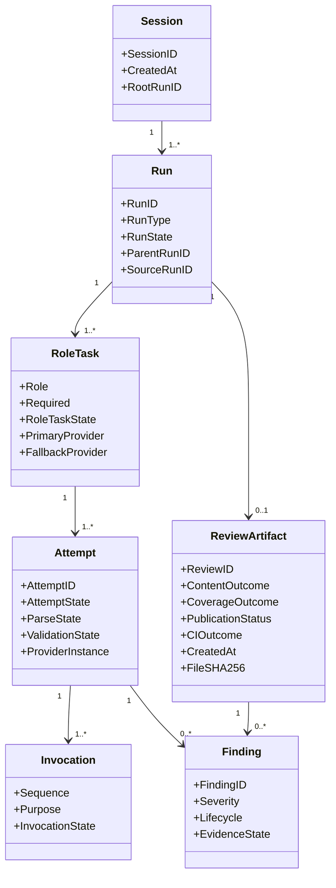
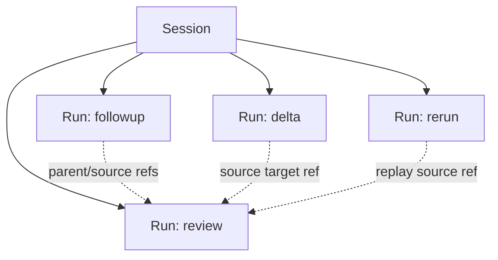
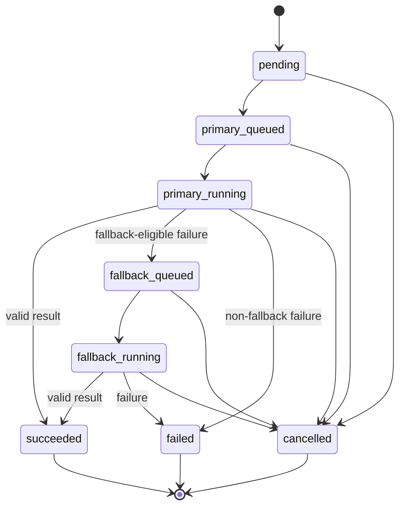

# Domain and State Model

## 1. Aggregate Model

KAR separates lineage, execution, review content, and publication.



## 2. Identifier Policy

All identifiers use canonical lowercase, hyphenated UUIDv7 values. Prefixes distinguish entity types where they appear as directories or logs.

| Entity | Format | Created when |
|---|---|---|
| Session | `s_<uuidv7>` | A new independent review lineage starts |
| Run | `r_<uuidv7>` | Any `review`, `followup`, `delta`, or `rerun` command starts |
| Attempt | `a_<uuidv7>` | The coordinator creates a provider attempt |
| Review | `<uuidv7>` | Final validation succeeds and publication begins |

Example:

```text
session_id = s_019f596a-cf80-7c67-b265-f37053d51ccf
run_id     = r_019f596a-cfe4-7c9c-b82e-7149158243ba
attempt_id = a_019f596a-d048-79e7-b2b7-59822f012273
review_id  = 019f596a-d174-7321-b920-c2d312c82cc2
```

UUIDv7 supports approximate chronological sorting. Exact program order uses recorded timestamps and coordinator sequence numbers. Clock regression must not be hidden.

## 3. Session and Run Lineage

A session groups related review activity. A run is one immutable execution.



Rules:

- `review` without `--session` creates a new session and root run.
- `followup`, `delta`, and `rerun` normally create a new run in the source run's session.
- A run never appends attempts to a completed source run.
- A published artifact never changes after publication.
- Cross-session references are rejected unless an explicit import workflow is later specified.

## 4. State Types

State domains must not be collapsed into one enum.

### 4.1 Run state

```text
pending
running
completed
degraded
failed
cancelled
```

### 4.2 Role task state

```text
pending
primary_queued
primary_running
fallback_queued
fallback_running
succeeded
failed
cancelled
blocked
```

### 4.3 Attempt state

An attempt is one logical primary or fallback provider selection for a role task. It contains one initial invocation and may contain bounded repair invocations.

```text
queued
running
validating
repairing
succeeded
failed
timed_out
cancelled
blocked
```

### 4.4 Invocation state

An invocation is one child-process execution. Invocation purpose is `initial` or `repair`.

```text
queued
running
succeeded
failed
timed_out
cancelled
blocked
```

### 4.5 Parse state

```text
not_started
valid
invalid_json
empty_output
output_too_large
```

### 4.6 Validation state

```text
not_started
valid
repaired_valid
invalid
repair_exhausted
internal_error
```

### 4.7 Evidence state

```text
verified
partially_verified
unverified
invalid_path
invalid_line
quote_mismatch
outside_review_scope
```

### 4.8 Independent outcome axes

Outcome axes are serialized separately and are never collapsed into a run state or one verdict enum.

| Axis | Enum |
|---|---|
| `content_verdict` | `no_findings`, `findings_present`, `request_changes` |
| `coverage_status` | `complete`, `degraded`, `incomplete` |
| `publication_status` | `not_published`, `staged`, `installed`, `committed`, `corrupt` |
| `ci_decision` | `pass`, `fail` |

`content_verdict` is calculated from valid normalized findings even when required coverage is incomplete. `ci_decision` is a separate policy projection with reasons; it does not erase content, coverage, or publication information.

### 4.9 Finding severity

```text
info
low
medium
high
critical
blocker
```

### 4.10 Finding lifecycle

```text
open
acknowledged
resolved
dismissed
```

### 4.11 Followup resolution

```text
resolved
partially_resolved
still_open
unclear
```

## 5. Role Task Transition



The central coordinator owns transitions. Lane workers execute child-process invocations but do not decide run completion, fallback eligibility, repair policy, or required-role coverage.

## 6. Outcome Computation

Provider output does not set any authoritative outcome. KAR computes each axis after normalization and policy evaluation.

### 6.1 Content and coverage

1. `coverage_status=incomplete` when a required role lacks a valid complete result after its allowed attempts; valid findings from every other role remain retained.
2. Otherwise `coverage_status=degraded` when a selected non-required role lacks a valid complete result or a selected result has permitted degraded material/evidence coverage.
3. Otherwise `coverage_status=complete`.
4. If no normalized findings exist, `content_verdict=no_findings`.
5. Otherwise, if any finding severity is at or above `review.request_changes_on`, `content_verdict=request_changes`.
6. Otherwise `content_verdict=findings_present`.

Severity order is exactly `info < low < medium < high < critical < blocker`; moving the request-changes threshold right weakens enforcement and is forbidden in CI. The recommended threshold is `high`.

### 6.2 CI projection

`ci_decision=fail` only when valid content or coverage matches configured CI policy. The default `degraded_review_fails=true` causes degraded coverage to fail CI. Required incomplete coverage retains valid content, may be durably committed after content validation, and has typed exit `4`; it is not reclassified as a content verdict. A valid `request_changes` result may return exit `1` by CI policy.

### 6.3 Publication state and recovery authority

`persisted_journal_state` is a recovery hint only:

```text
collecting | content_validated | final_staged | final_file_installed | manifest_committed | completed
```

`publication_status` is derived on every recovery from durable observations, not copied from the journal. The classifier applies exactly this precedence once:

```text
ambiguity_or_mismatch > valid P2 committed > valid P1 installed > valid P0 staged > P0 none hint recovery > corrupt default
```

- `P2_COMMITTED` requires a valid composite epoch referencing matching immutable manifest and lineage-edge hashes, a committed manifest, exactly one canonical final path, and final bytes matching the manifest. Only P2 authorizes `committed`.
- `P1_INSTALLED` requires no P2 and exactly one schema-valid canonical final matching recovery-journal expected path and hash. It is `installed`, not published, and recovery only completes the composite commit.
- `P0_STAGED` requires no P2/P1 and exactly one complete schema-valid staged file matching recovery-journal expected path and hash. It is `staged`; recovery revalidates, fsyncs, and atomically installs it.
- `P0_NONE` has no staged or installed final and no forbidden partial or multiple artifact. `collecting`, `content_validated`, and `final_staged` resume from immutable validated inputs; a `final_file_installed`, `manifest_committed`, or `completed` hint is corrupt.
- Multiple staged/final files, hash/path/schema mismatch, missing journal for P0/P1, staged-and-installed conflict, missing committed final, split manifest/edge/epoch, symlink/non-regular file, or path escape is `corrupt`, writes only an immutable diagnostic, and exits `7`.

A valid P2 remains committed even when its persisted hint is lower; its stored outcome projects exit `0`, `1`, or `4`. A valid P1 or P0 recovers forward idempotently and never replaces installed or committed bytes. Crash alone never changes a valid P2 to exit `7`.
#### Cross-boundary recovery fixtures

The total fixture map includes these exact cases; a classifier result other than the stated status, authority, action, and exit is artifact failure `7`.

| Fixture ID | Persisted hint / durable observation | Result and recovery |
|---|---|---|
| `pub-cross-content-validated-staged-temp` | `content_validated` / valid P0 staged temp | `staged`, P0; install then composite commit; final `0`, `1`, or `4` |
| `pub-cross-final-staged-installed-final` | `final_staged` / valid P1 installed final | `installed`, P1; composite commit then P2; final `0`, `1`, or `4` |
| `pub-cross-final-installed-composite-commit` | `final_file_installed` / valid P2 composite | `committed`, P2; reconstruct mutable status only; stored `0`, `1`, or `4` |
| `pub-cross-manifest-committed-completed-side-effect` | `manifest_committed` / valid P2 and completed status | `committed`, P2; verify or reconstruct idempotently; stored `0`, `1`, or `4` |
| `pub-cross-hint-low-valid-p2` | `collecting` or `content_validated` / valid P2 | `committed`, P2; reconstruct status, never republish; stored `0`, `1`, or `4` |
| `pub-cross-staged-and-installed-conflict` | any / conflicting staged and installed files | `corrupt`; immutable diagnostic only; `7` |
| `pub-cross-p2-manifest-edge-mismatch` | any / incomplete or mismatched composite | `corrupt`; final is untrusted; `7` |
| `pub-cross-completed-missing-final` | `completed` / P2 members but final missing | `corrupt`; completed bytes are not rewritten; `7` |
| `pub-cross-final-installed-no-journal` | `final_file_installed` / valid-looking final without expected path/hash | `corrupt`; no adoption or regeneration; `7` |
| `pub-cross-p0-none-impossible-high-hint` | `manifest_committed` or `completed` / P0 none | `corrupt`; immutable diagnostic only; `7` |
### 6.4 Required roles and deterministic assignment

The role order is fixed: `logic`, `security`, `maintainability`, `product`, `documentation`, `testing`. `logic` and `security` are the code-fixed required floor. The sole project-local configuration may add enabled roles to `review.required_roles`; it cannot remove the floor.

Provider tuples use NFC fields and the normalized ASCII `concurrency_key`. A tuple key is the UTF-8 byte lexical tuple `(family, instance_id, version, binary_sha256, normalized_concurrency_key)`. Enumerate all six-role assignments, discard candidates that lack one base-plus-role-fit PASS primary per role, or lack different-key eligible fallbacks for `logic` and `security`. When any complete feasible candidate gives logic and security different primary instances, candidates that share one are discarded. Optional-role fallback is the lexical-first eligible different-key tuple or `null`. Select the lexicographically smallest canonical JSON vector `[role,primary_tuple_key,fallback_tuple_key_or_null]` in fixed role order. There is no score, latency, or heuristic tie-breaker; zero candidates block readiness and exactly six rows are required.

## 7. Finding Identity

AI providers do not assign final finding IDs. KAR assigns run-local IDs after validation and deterministic ordering:

```text
F001
F002
F003
```

External references use a run-scoped form:

```text
{run_id}/F001
```

A stable fingerprint supports cross-run matching:

```text
SHA-256(normalized rule/category + normalized path + normalized evidence region)
```

The fingerprint is an aid, not proof that two findings are identical. Followup matching retains both the explicit source finding reference and any calculated fingerprint.

## 8. Deterministic Ordering

Final findings are sorted by:

1. severity rank descending;
2. normalized path ascending;
3. line start ascending;
4. role ascending;
5. provider instance ascending;
6. title ascending.

KAR assigns `F001` identifiers only after this sort. Provider timing must not change final finding numbering.
