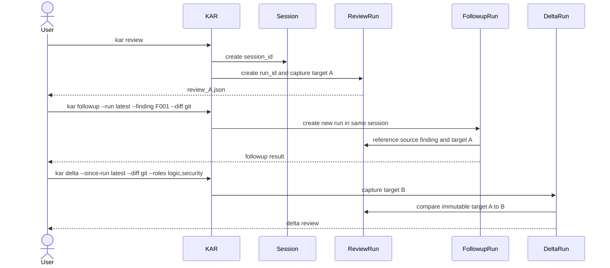

# CLI Workflows

## 1. Command Surface

```text
kar init
kar doctor
kar review
kar followup
kar delta
kar rerun
kar status
kar report
kar findings
kar excerpt
kar providers
kar config
kar prompt
kar schema
kar clean
kar export
kar help
```

## 2. Run-Creation Semantics

| Command | Main question | Prior run required | Target basis | Creates a new run |
|---|---|---:|---|---:|
| `review` | What issues exist in this new scope? | No | Full captured target | Yes |
| `followup` | Is a referenced finding resolved? | Yes | Current target plus source finding | Yes |
| `delta` | What issues exist only in changes since a prior reviewed snapshot? | Yes | Previous immutable snapshot to current snapshot | Yes |
| `rerun` | Can an attempt be repeated after instability or invalid output? | Yes | Exact or recomposed source scope | Yes |
## 2.1 Complete 17-command contract

The command-result envelope is `https://kar.local/schemas/kar-command-result.v1.schema.json`. Every request variant is its literal `#/$defs/requests/<command>` pointer; provider-output schemas are never command requests. Every command returns the command-result envelope in addition to the explicitly listed output contracts. Typed exits are exhaustive for the command surface: policy `1`, usage/configuration `2`, readiness/coverage `4`, artifact/evidence/publication/stale `7`, security `8`, cancellation `9`, and internal invariant `10`.
G008 implements the frozen request contract and its two-phase boundary: CLI-only selectors are resolved and valueless stdin is captured before the schema-valid request is frozen. The frozen request contains canonical IDs and canonical target values only; it never contains `latest`, a role/provider rerun selector, or uncaptured stdin.

| Command | Owner / service | Required reads → writes | Primary output contracts | Typed exits |
|---|---|---|---|---|
| `init` | `internal/app/init` / `InitializeProject` | embedded defaults and intended provider list → project YAML | command result | 2, 7 |
| `doctor` | `internal/app/doctor` / `DiagnoseEnvironment` | config, binaries, provider/platform evidence → redacted diagnostic | doctor result, command result | 2, 4, 7, 8 |
| `review` | `internal/app/review` / `StartReviewRun` | target, resolved policy → run, prompts, attempts, final, epoch | run manifest v2, review artifact v2 | 1, 2, 4, 7, 8, 9, 10 |
| `followup` | `internal/app/followup` / `StartFollowupRun` | source run/review/finding and target → child run and final | provider followup output v2, run manifest v2, review artifact v2 | 1, 2, 4, 7, 8, 9, 10 |
| `delta` | `internal/app/delta` / `StartDeltaRun` | source and current targets/runs → child artifacts | run manifest v2, review artifact v2 | 1, 2, 4, 7, 8, 9, 10 |
| `rerun` | `internal/app/rerun` / `StartRerun` | source run and prompt → exact or recomposed child artifacts | run manifest v2, review artifact v2, prompt manifest v1 | 1, 2, 4, 7, 8, 9, 10 |
| `status` | `internal/app/query` / `ReadRunStatus` | manifest, epoch, diagnostics → none | run manifest v2 | 2, 7, 8, 9, 10 |
| `report` | `internal/app/report` / `RenderReport` | committed review and evidence → `report.md` | command result | 2, 7, 8, 9, 10 |
| `findings` | `internal/app/query` / `ListFindings` | review → none | review artifact v2 | 2, 7, 8, 9, 10 |
| `excerpt` | `internal/app/query` / `RenderExcerpt` | target, review, evidence → none | command result | 2, 4, 7, 8, 9, 10 |
| `providers` | `internal/app/providers` / `ListProviderProfiles` | config and provider evidence → none | provider-contract evidence v1 | 2, 4, 7, 8 |
| `config` | `internal/app/config` / `ResolveConfiguration` | built-in, global, trusted-base project, CLI → resolved policy | run manifest v2 | 2, 8 |
| `prompt` | `internal/app/prompt` / `InspectPrompt` | template and untrusted references → guarded stdin metadata | prompt manifest v1 | 2, 7, 8, 10 |
| `schema` | `internal/app/schema` / `InspectSchema` | embedded schemas → optional export | command result | 2, 7 |
| `clean` | `internal/app/clean` / `PlanAndApplyRetention` | manifests, edges, epoch → plan, tombstone, deletion receipt | clean plan v1 | 2, 7, 8 |
| `export` | `internal/app/export` / `ExportRedactedRun` | immutable run and review → secure bundle and manifest | export manifest v1 | 2, 7, 8 |
| `help` | `internal/app/help` / `RenderHelp` | embedded docs → none | command result | 2 |

The literal non-command output URIs are `https://kar.local/schemas/kar-doctor-result.v1.schema.json`, `https://kar.local/schemas/kar-run-manifest.v2.schema.json`, `https://kar.local/schemas/kar-review-artifact.v2.schema.json`, `https://kar.local/schemas/kar-provider-followup-output.v2.schema.json`, `https://kar.local/schemas/kar-provider-contract-evidence.v1.schema.json`, `https://kar.local/schemas/kar-prompt-manifest.v1.schema.json`, `https://kar.local/schemas/kar-clean-plan.v1.schema.json`, and `https://kar.local/schemas/kar-export-manifest.v1.schema.json`. A command's response must retain independent content, coverage, publication, and CI outcomes rather than synthesizing one verdict.
For G006, successful `status` results include the durable `recovery_action` and expose `final_artifact_uri` only for a validated P2 commit; errored status results retain the selected `run_id` but use null authority fields. Successful JSON `excerpt` results carry the exact verified bytes as canonical RFC 4648 `excerpt_base64` plus `excerpt_sha256`, where the digest is computed over the decoded transport bytes; non-verified results carry neither. Nonzero `status`, `report`, `findings`, and `excerpt` results use the explicit `status_failed`, `report_failed`, `findings_failed`, and `excerpt_failed` kinds. Report output validation rejects case aliases of `.kar`, `.git`, `.gjc`, and KAR-owned root configuration names before any publication lookup.

## 2.2 Gate and readiness semantics

`init` records all configured intended provider IDs with `status=unverified` when evidence is unavailable. It must neither silently disable nor substitute them; `doctor` is required before review readiness can be claimed. `doctor`, `providers`, and `status` expose `PASS`, `FAIL`, or `INCONCLUSIVE` evidence without promoting it. `INCONCLUSIVE` is not PASS.

No command, including `init`, `doctor`, or `schema`, authorizes product implementation, authority-ref mutation, or `g0_complete`. Those actions require the separate session-bound G0 approval DAG.

## 3. `kar review`

Starts an independent review.

```bash
kar review --diff origin/main...HEAD \
  --objective "Review this change before merge."
```

```bash
kar review --diff git \
  --roles logic,security,testing
```

```bash
cat change.patch | kar review --stdin \
  --objective "Focus on fallback state transitions."
```

Semantics:

- resolves symbolic Git refs to immutable object IDs at run start;
- captures valueless `--stdin` through the resolver before constructing the canonical `target={kind:"stdin",value:...}` request value;
- captures the target before provider execution;
- creates a new session unless `--session` is explicitly provided for an imported workflow;
- does not inherit findings from another run;
- publishes at most one final review artifact.

## 4. `kar followup`

Evaluates one prior finding.

```bash
kar followup --run latest --finding F_SOURCE-1 --stdin \
  --objective "Verify only whether the original issue is resolved."
```

Optional role targeting:

```bash
kar followup --run r_019f596a-cf80-7c67-b265-f37053d51ccf --finding F003 --diff git \
  --role logic
```

Semantics:

- requires a valid source run and finding reference;
- includes the original finding, verified evidence, and current target context;
- returns `resolved`, `partially_resolved`, `still_open`, or `unclear`;
- does not replace or mutate the original finding;
- may report a newly introduced blocker, but does not silently become a broad review.

## 5. `kar delta`

Reviews the difference between immutable target snapshots.

```bash
kar delta --since-run latest --diff git --roles logic,security
```

Delta is defined as:

```text
source run target snapshot -> newly captured target snapshot
```

It is not defined as a comparison of ref names or only two patch hashes. The source run must contain sufficient immutable target metadata.
`--since-run` is the source selector. Its `latest` form resolves to a canonical `source_run_id` before the delta request is frozen; the frozen request has no selector field.

Rules:

- old findings are background only;
- delta does not prove old findings were fixed;
- if the source target cannot be reconstructed, the command fails with a target error;
- stdin-only reviews support delta only if KAR materialized a comparable snapshot representation.

## 6. `kar rerun`

Repeats an attempt without mutating the source run.

```bash
kar rerun --run latest --role documentation --provider kimi-main
```

Replay modes:

| Mode | Behavior |
|---|---|
| `exact` | Reuses captured target bytes, composed prompt bytes, resolved adapter profile, and source attempt parameters |
| `recompose` | Reuses the target but composes a new prompt using current trusted templates and configuration |
A rerun accepts either `--attempt <attempt-id>` or exactly one `--role <role> --provider <provider>` selector. In the latter form, KAR resolves the run selector first and then resolves the role/provider pair to one canonical source attempt before freezing the request; the frozen request contains `source_run_id` and `source_attempt_id`, not the selector pair.

Default:

```text
kar rerun --run latest --attempt a_019f596a-cf80-7c67-b265-f37053d51ccf --replay exact
```

`rerun` is for timeout, provider instability, invalid JSON, or other execution-quality problems. A code change intended to resolve a finding should use `followup` or `delta`.

## 7. Target Selection

Supported target inputs:

```text
--diff git
--diff <base>...<head>
--patch <path>
--stdin
```

`--stdin` is valueless at the CLI boundary. KAR captures it before canonical target creation; the frozen request records the resulting nonempty canonical stdin target value.

For Git targets, KAR captures:

- repository identity;
- base object ID;
- head object ID;
- head tree object ID;
- index tree object ID when applicable;
- staged and unstaged patch bytes according to selected mode;
- untracked manifest when explicitly included;
- canonical target SHA-256.

KAR never stores only a mutable ref such as `origin/main` as the source of truth.

## 8. `latest` Resolution

`latest` is scoped to the current project root and artifact root.
`latest` is a CLI selector, not a request value. KAR resolves it before request freezing for every command that accepts it, including `--since-run` for `delta`, `--run` for `followup`, `rerun`, and `export`.

Resolution order:

1. valid session and run directories only;
2. `created_at` from run manifests;
3. run UUIDv7 as a stable tiebreaker.

A corrupt or incomplete manifest is skipped with a diagnostic. Directory modification time is not authoritative.

## 9. Typical Lineage



## 10. Artifact Maintenance

```bash
kar clean --mode plan
kar clean --mode apply --expected-plan-sha256 sha256:bbbbbbbbbbbbbbbbbbbbbbbbbbbbbbbbbbbbbbbbbbbbbbbbbbbbbbbbbbbbbbbb
kar export --run latest --output-path exports/kar-review.zip --output human
```

`clean` obtains retention age, size thresholds, and explicit keep IDs from resolved policy, not CLI retention flags. `export` requires a safe relative `--output-path`; redaction is unconditional, and `--output` selects only the command-result format (`json` or `human`), never export redaction or destination.

`clean` operates only inside the validated artifact root and never follows symlinks. `export` creates a new secure-writer package and never mutates the source run, grants publication authority, or authorizes release.
`clean` is deterministic. Its resolved-policy inputs are `retention_age`, `min_age_for_size`, `target_bytes`, and explicit keep IDs, plus fixed `now` and store epoch `E0`. The retained seed is explicit keep IDs plus active, uncommitted, corrupt, and newest completed-per-session runs; transitive ancestors are retained, and a graph anomaly protects its reachable component.

It computes `age_delete_set` first from unprotected completed runs older than `now-retention_age`, then `size_delete_set` from remaining unprotected completed runs no newer than `now-min_age_for_size` until regular-file lstat bytes after planned deletion are at most `target_bytes`. Each set sorts by `(completed_at UTC epoch nanoseconds ascending, run_id UTF-8 ascending)`; missing or invalid time is protected. A dry run emits one canonical clean plan with resolved-policy inputs, `E0`, ordered actions, reasons, edge references, byte counts, and plan hash. Apply requires the exact `--expected-plan-sha256`, unchanged `E0`, and unchanged input-policy hash; a stale plan exits `7` without recomputing. Tombstone commit precedes deletion, restart resumes the tombstone, and an unjournaled partial directory is protected as corrupt.

## 11. Help-First Requirements

Required help topics:

```text
kar help quickstart
kar help config
kar help providers
kar help roles
kar help lanes
kar help prompts
kar help workflows
kar help artifacts
kar help validation
kar help ci
kar help exit-codes
kar help security
```

Help must explain:

- functional roles and lack of approval authority;
- serial execution per concurrency key and parallel execution across keys;
- the difference among four run types;
- why a valid negative review does not trigger fallback;
- where final and intermediate artifacts are stored;
- that provider commands and versions require readiness checks;
- that targets may be transmitted to remote provider services;
- that project configuration cannot define executable commands by default.

## 12. Required Command Diagnostics

Every user-facing failure should include:

```text
stage
session_id when available
run_id when available
role when applicable
provider instance when applicable
attempt_id when applicable
failure class
whether fallback was attempted or prohibited
artifact path for diagnostics
recommended next command
```
