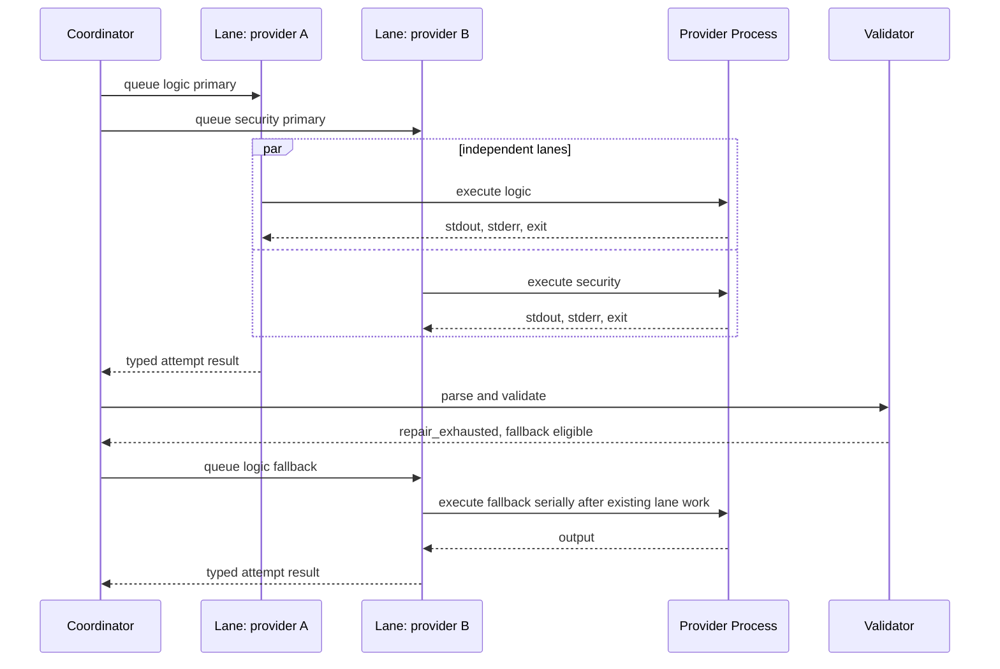

# Provider Runtime and Scheduling

## 1. Runtime Responsibilities

The provider runtime converts a validated role task into bounded child-process attempts. It is responsible for:

- resolving an assigned supported provider family, runtime capability contract, and adapter profile;
- creating an isolated attempt workspace;
- materializing prompt and target inputs;
- constructing direct argv execution;
- passing an allowlisted environment;
- enforcing timeout and output limits;
- capturing stdout and stderr separately;
- cancelling the complete process group;
- classifying execution failure; and
- preserving immutable attempt artifacts through the shared scan-before-write path.

It does not decide content, coverage, publication, or CI outcomes; it reports immutable typed attempt results to the central coordinator.
G010 is `IMPLEMENTATION_IN_PROGRESS`. Production closure requires the exact Config v2 assignment and real-provider gate defined by SOT 1.10.0.

## 2. Driver, Instance, and Lane

| Concept | Meaning |
|---|---|
| Driver | G0 provider-family adapter: exactly `kimi`, `zcode`, or `agy` |
| Provider instance | Local executable plus account/profile, adapter options, approved limits, and concurrency key |
| Lane | Serial work queue for one normalized `concurrency_key` |
| Role task | Required or selected work for one of the six fixed functional roles |
| Attempt | One logical primary or fallback provider selection for a role task |
| Invocation | One child-process execution inside an attempt, with purpose `initial` or `repair` |

`codex` and `claude` are rejected: they are not G0 provider families, inventory entries, assignment-fixture candidates, or permitted configuration until a separately approved SOT extension authorizes them. Different provider instances share a lane when their normalized concurrency keys are equal.

## 3. Central Coordinator

A central coordinator owns the run graph. Lane workers execute invocations and report typed outcomes. An attempt aggregates one initial invocation and any bounded repair invocation.

Coordinator responsibilities:

- create all selected role tasks;
- queue primary attempts and their initial invocations;
- keep lane queues open while dynamic fallback can still occur;
- classify attempt outcomes;
- decide whether repair or fallback is allowed;
- queue repair invocations and fallback attempts when policy permits;
- maintain required-role coverage;
- propagate cancellation;
- determine terminal run state;
- produce deterministic ordering independent of completion timing.

The coordinator does not invent family preferences. Config v2 owns each
role's primary and optional fallback family; planning resolves those exact
families to current qualified routes. A missing or unqualified configured route
fails planning instead of authorizing substitution.

Lane worker responsibilities:

- receive a queued attempt;
- acquire in-process and optional cross-process lane locks;
- execute one provider invocation;
- capture artifacts;
- return an immutable typed attempt result.

## 4. Scheduling Flow



## 5. Lane Invariants

1. At most one active child-process invocation exists per `concurrency_key` in one KAR process.
2. Independent concurrency keys may run in parallel up to `runtime.max_active_lanes`.
3. A role task has at most one active logical attempt at a time, and an attempt has at most one active invocation.
4. Fallback is queued only after the primary attempt reaches a terminal, fallback-eligible outcome.
5. A provider finding, including a blocker, does not trigger fallback.
6. Lane completion never implies run completion. Only the coordinator closes the run.
7. Cancellation prevents new fallback attempts.

The normalized concurrency key is NFC input followed by ASCII lowercase. Non-ASCII values are rejected; valid values match `[a-z0-9](?:[a-z0-9._-]{0,62}[a-z0-9])?`. All equal normalized values share one lane across the run.
## 6. Cross-Process Serialization

In-process goroutines do not prevent two separate `kar` processes from invoking the same provider concurrently.

Recommended default for local interactive use:

```text
$XDG_RUNTIME_DIR/kar/locks/{normalized_concurrency_key}.lock
```

Fallback when `XDG_RUNTIME_DIR` is unavailable:

```text
${TMPDIR}/kar-{uid}/locks/{normalized_concurrency_key}.lock
```

The lock file stores non-authoritative diagnostic metadata such as PID, run ID, attempt ID, and acquisition time. OS-level file locking is authoritative. Stale file contents alone must not block execution.

CI may disable cross-process locking only when runners are isolated.

## 7. Attempt Workspace

Init-generated setting:

```yaml
execution:
  workspace_access: none
```

The provider receives only a temporary packet:

```text
attempt-workspace/
  composed-prompt.txt
  review-target.patch
  output-schema.json
  referenced-evidence/
```

Available modes:

| Mode | Provider access | Init selection |
|---|---|---:|
| `none` | Prompt packet and captured target only | Yes |
| `readonly_snapshot` | Isolated, read-only materialized snapshot | No |
| `project` | Rejected legacy/unsafe value; the actual project root is never exposed | Not selectable |

Workspace access is closed to `none|readonly_snapshot`; `kar init` writes the required value `none`. `readonly_snapshot` remains an immutable read-only snapshot; native `@file` transport refers only to captured material. Kimi and ZCode receive an isolated `HOME` with their projected credentials; neither mode may expose the live project root. AGY is the narrow macOS authentication exception defined in §8.1, not a workspace-access exception.

Production discovery accepts only canonical absolute paths from the admitted
project-local configuration. It performs no PATH lookup. Ambient
`XDG_CONFIG_HOME` and `KIMI_CODE_HOME` are not runtime authorities; Kimi's
projection source is the configured `data_home`, and every child XDG/Kimi home
is a lease-local destination.

ZCode's configured Node path is an executable identity. Its CJS launcher is a
separate readable regular-file identity: KAR descriptor-opens, hashes, and
revalidates it without requiring the execute bit before Node consumes it.

## 8. Direct Process Contract

Preferred invocation:

```text
execve(resolved_bin, resolved_argv, allowlisted_env)
```

Default requirements:

- no TTY;
- no interactive session;
- no shell;
- stdin, argv, or temporary-file prompt transport;
- stdout reserved for provider result;
- stderr retained as diagnostics, never parsed as review JSON;
- explicit timeout;
- explicit maximum stdout and stderr sizes;
- process-group termination on timeout or cancellation.
### 8.1 AGY macOS authentication and namespace boundary
On macOS, AGY authentication is bound to the installed user's native `HOME` and Keychain context. KAR explicitly captures that installed-user `HOME` and inode-revalidates it immediately before AGY spawn; AGY alone receives it for authentication. KAR must not substitute a synthetic `HOME`, copy OAuth or installation files into one, or project AGY credentials. KAR's namespace setup, policy handling, and cleanup must never write, overwrite, zero, or unlink the user's AGY authentication or settings files. AGY itself may perform its normal Keychain/profile refresh while running; KAR does not misrepresent that provider-owned behavior as namespace-owned mutation or cleanup.

The authentication `HOME` is distinct from the descriptor-bound immutable review CWD, which remains the captured snapshot. KAR owns AGY's XDG, cache, temporary, and scratch namespaces; they do not relocate or authorize mutation of the installed user's AGY state. Kimi and ZCode retain isolated `HOME` directories plus credential projection.

KAR does not install an AGY `settings.json` policy. Its enforceable AGY controls are direct argv with `--sandbox`, the exact immutable-snapshot `--add-dir`, `--mode plan`, bounded time and output, and post-output process-group `SIGTERM` followed by `SIGKILL` when required. G010 does not claim this boundary complete until the non-skipping actual-AGY E2E and final `make test` succeed.

If a provider prints non-result logs to stdout, its adapter must deterministically isolate the result. Generic heuristic extraction is not a default supported contract.

## 9. Typed failure matrix

`repair` and `fallback` are independent axes. `fallback=allowed` means the coordinator may schedule a configured eligible fallback; it neither promises fallback success nor authorizes publication.

| Stable condition | Typed condition | Repair | Fallback | Required attempt artifact | Exhaustion projection |
|---|---|---:|---:|---|---|
| `G0-FAIL-01` | invalid JSON or missing AI-owned mandatory value | exactly 1 | allowed after repair | constrained repair request and validation receipt | required incomplete exit `4`; optional degraded policy |
| `G0-FAIL-02` | `timeout` | none | allowed | bounded stderr/process diagnostic | same |
| `G0-FAIL-03` | `auth` | none | allowed | redacted typed auth diagnostic; no credential bytes or hashes | same |
| `G0-FAIL-04` | `quota` | none | allowed | typed quota diagnostic | same |
| `G0-FAIL-05` | `rate_limit` | none | allowed | typed rate-limit diagnostic | same |
| — | valid finding, including high/blocker | none | forbidden | validated result | content remains valid; CI may exit `1` |
| — | known runtime capability incompatibility | none | forbidden | actionable typed capability diagnostic with diagnostic provenance | configuration `2` or execution failure as classified |
| — | unlisted provider family | none | forbidden | typed unsupported-family diagnostic | configuration `2` |
| — | secret, mutation, configuration, artifact, cancellation, or internal invariant | none | forbidden | typed safe diagnostic only | security `8`, configuration `2`, artifact `7`, cancellation `9`, or internal `10` |

If no configured eligible fallback exists, `fallback_scheduled=false` and the role is immediately exhausted despite `fallback=allowed`. An exhausted required role gives `coverage_status=incomplete`, preserves valid content from all roles, and exits `4`. An exhausted optional role gives `coverage_status=degraded`; valid content may commit, and CI uses `degraded_review_fails=true` by default.

## 10. Bounded repair, resource budgets, and deadlines

For repairable invalid provider output:

```text
initial attempt → deterministic validation → at most one constrained repair → deterministic revalidation → eligible fallback
```

Repair is part of the same attempt provenance. It does not create a new role result or review scope.

Defaults are: primary initial plus one repair, fallback initial plus one repair, at most four invocations per role, and at most 24 invocations per run. Each invocation's stdout, stderr, and timeout caps come from the approved profile and cannot exceed the trusted harness ceiling.

```text
run_total_output_cap =
  Σ six roles Σ present(primary initial, primary repair, fallback initial, fallback repair)
    (stdout_cap + stderr_cap)
```

An assignment is ineligible when this value exceeds 64 MiB. For each normalized lane, its deadline is the sum of all possible assigned invocation timeouts plus two seconds per possible repair or fallback transition. The run deadline is `max(lane_deadlines) + 5s`; it must be at most 30 minutes. The assignment receipt records all operands, caps, formulas, rejections, and default sources.

## 11. Provider and platform contract evidence

Provider and platform evidence v1 is byte-identical compatibility-only input and cannot enter readiness. Only `kar-provider-contract-evidence.v2` and `kar-platform-contract-evidence.v2` are readiness authority for the historical G0 qualification record; G001 satisfied the complete v2 G0 evidence conjunction and authority chain. G007's intended support is exactly `kimi`, `zcode`, and `agy`: admission requires an allowlisted family, the applicable minimum version, and current runtime capability and security PASS. A newer version is allowed after that PASS; authorization is not pinned to an exact version, executable path, SHA allowlist, profile, or historical evidence tuple, which remain diagnostic provenance for issue reports and reproducibility. A missing required capability or security admission produces an actionable typed diagnostic, and a documented known incompatibility may be explicitly blocked. Unlisted families remain rejected, and failure never authorizes automatic provider substitution. Prior G009 integrated receipts are `HISTORICAL_GATE_PASS_NON_PRODUCTION`; the historical controlled exact-Kimi no-SKIP tuple is `kimi/local-default/0.23.6/50c3582a1beeba081271193b74efc39c51b3a0a16b4bf32b754b9482a86a314a/kimi-default`. It neither substitutes for nor alters current family, minimum-version, capability, and security admission, and it is diagnostic evidence only, not an admission pin. The append-only G009 ledger also records two later 2026-07-18 opt-in retries that each ended after approximately 30.15 seconds with `status=timeout`, `termination=timed_out`, and `diagnostic=process_timeout`; those later liveness failures do not replace the earlier PASS.
`doctor` reports a fixed three-family inventory and the admission result for each configured family. It does not rediscover provider paths or models from ambient state, and both human and machine output are ANSI-free.

G0 provider readiness is evidence, not an assertion from configuration. Runtime and canonical label order is exactly `kimi`, `zcode`, `agy`; lexical sorting is forbidden. Each family has the same exact 16 probes:

```text
PV-VERSION, PV-NONINTERACTIVE, PV-PROMPT-TRANSPORT, PV-JSON-ONLY,
PV-STDOUT-STDERR, PV-CANCELLATION, PV-OUTPUT-CAP, PV-AUTH-CACHE-CONCURRENCY,
PV-EXIT-CLASSIFICATION, PV-CWD-ISOLATION
PV-ROLE-FIT-logic, PV-ROLE-FIT-security, PV-ROLE-FIT-maintainability,
PV-ROLE-FIT-product, PV-ROLE-FIT-documentation, PV-ROLE-FIT-testing
```

For the historical G0 qualification record only, `provider_verified` was the conjunction of all three runtime tuples × all 16 probes (**48 PASS**), all three family secure-writer indexes (**3 PASS**), and a live assignment receipt (**PASS**). That historical promotion gate is not the current runtime configuration rule. Current runtime admission evaluates exactly the configured nonempty subset; one eligible family is operational with degraded resilience, two or three eligible families are ready when required different-key fallbacks exist, and an omitted family is `not_configured`, not a readiness failure.

The platform inventory and G0 execution scope are:

| Cell | `contract_scope` | Blocking for external readiness | Current support/release state |
|---|---|---:|---|
| `darwin-arm64` | `required` | Yes | Historical G001 native/local-POSIX evidence and prior G009 integrated receipts (`HISTORICAL_GATE_PASS_NON_PRODUCTION`) do not production-verify or close the composed production root review; no release asset was authorized or created |
| `linux-amd64` | `intended_future` | No | Unsupported and release-ineligible |
| `linux-arm64` | `intended_future` | No | Unsupported and release-ineligible |
| `darwin-amd64` | `intended_future` | No | Unsupported and release-ineligible |

The sole required cell, `darwin-arm64`, requires native execution and local POSIX filesystem evidence for:

```text
PL-IDENTITY-NATIVE, PL-LOCAL-FS, PL-SAME-DEVICE, PL-PROCESS-GROUP,
PL-LOCK-STALE, PL-PERMISSION, PL-SYMLINK, PL-RENAME, PL-FILE-FSYNC,
PL-DIR-FSYNC, PL-RECOVERY
```

Each future row is fixed as `native_execution=false`, `observed_os=null`, `observed_arch=null`, `filesystem_class=unknown`, and all 11 probes `NOT_RUN` with `reason=not_run` and null references. Future inventory rows are non-blocking and must not be executed, promoted to support, or made release-eligible by this G0 contract.

`external_contract_readiness` remains `UNVERIFIED` until the required `darwin-arm64` platform evidence and complete provider readiness conjunction PASS. G001's historical evidence state satisfied those inputs plus promotion, authority compare-and-swap, and post-verification; it does not production-verify or close the currently reopened composed root review. Configuration intent, partial evidence, a future row, or a non-native result still cannot promote readiness.

### 11.1 Canonical G0 probe argv

The CWD is the repository root. Each following line is the exact compact RFC 8259 JSON argv array for its provider family or required platform cell; shell parsing, alternation, globbing, environment interpolation, and empty arguments are forbidden.

```json
["/usr/bin/env","python3",".gjc/_session-019f5a09-5eec-7000-84df-094fcc21b1ce/g0/tools/provider_probe.py","run","--family","kimi","--probe-manifest",".gjc/_session-019f5a09-5eec-7000-84df-094fcc21b1ce/g0/fixtures/provider-probes.json","--runtime-contract",".gjc/_session-019f5a09-5eec-7000-84df-094fcc21b1ce/g0/fixtures/provider-runtime-contract.v1.json","--gate-receipt",".gjc/_session-019f5a09-5eec-7000-84df-094fcc21b1ce/evidence/g0/gates/gate-a2.json"]
["/usr/bin/env","python3",".gjc/_session-019f5a09-5eec-7000-84df-094fcc21b1ce/g0/tools/provider_probe.py","run","--family","zcode","--probe-manifest",".gjc/_session-019f5a09-5eec-7000-84df-094fcc21b1ce/g0/fixtures/provider-probes.json","--runtime-contract",".gjc/_session-019f5a09-5eec-7000-84df-094fcc21b1ce/g0/fixtures/provider-runtime-contract.v1.json","--gate-receipt",".gjc/_session-019f5a09-5eec-7000-84df-094fcc21b1ce/evidence/g0/gates/gate-a2.json"]
["/usr/bin/env","python3",".gjc/_session-019f5a09-5eec-7000-84df-094fcc21b1ce/g0/tools/provider_probe.py","run","--family","agy","--probe-manifest",".gjc/_session-019f5a09-5eec-7000-84df-094fcc21b1ce/g0/fixtures/provider-probes.json","--runtime-contract",".gjc/_session-019f5a09-5eec-7000-84df-094fcc21b1ce/g0/fixtures/provider-runtime-contract.v1.json","--gate-receipt",".gjc/_session-019f5a09-5eec-7000-84df-094fcc21b1ce/evidence/g0/gates/gate-a2.json"]
["/usr/bin/env","python3",".gjc/_session-019f5a09-5eec-7000-84df-094fcc21b1ce/g0/tools/platform_probe.py","run","--expected-cell","darwin-arm64","--probe-manifest",".gjc/_session-019f5a09-5eec-7000-84df-094fcc21b1ce/g0/fixtures/platform-probes.json","--gate-receipt",".gjc/_session-019f5a09-5eec-7000-84df-094fcc21b1ce/evidence/g0/gates/gate-a2.json"]
```

For each array, `argv_json_bytes` are the exact UTF-8 bytes above with no whitespace outside the compact JSON and no trailing LF. Its hash is `SHA-256(ASCII("KAR-G0-ARGV/1") || 0x00 || argv_json_bytes)`:

```text
kimi=c092d46a84dff52a23cf5a08637cf80346a9e6a39adbe3ddac62fbc180950129
zcode=724db2f4e04f01ca6240eae1f5a747ecaf9881696b18ad06cd98c53dd2f5458e
agy=bbc244436caa277d59ed6785f513f088ad9da292990d5bc6559ceb47eb346520
darwin-arm64=b04269cc9a3d8b7763d41e737a8b6a12e2dd49208314dea79448760293862c9b
bundle=c0353931bd27274e001b650a7a3f5e8d2fc7a1412e5a64c1bdf3ccad2adb1cd7
```

The ordered labels are exactly `provider:kimi`, `provider:zcode`, `provider:agy`, `platform:darwin-arm64`; the bundle preimage is `ASCII("KAR-G0-ARGV-BUNDLE/1\n") || Σ(ASCII(label) || 0x00 || raw32(argv_sha256) || 0x0A)` in that order. Provider v2 requires `--runtime-contract` and the fixed `--gate-receipt`. Legacy `--evidence-root` and `--index` are rejected by canonical validation and are not authority paths. `/usr/bin/env` resolution, Python version and executable hash, and script and fixture hashes are recorded and verified in `tools.lock.json` before child spawn. Any byte or hash mismatch is artifact exit `7`.

## 12. Attempt Artifacts

Each logical attempt records:

```text
status.json
candidate.initial.json
candidate.repaired.001.json
invocations/
  001-initial/
    command.json
    env.json
    status.json
    stdout.raw
    stderr.raw
    prompt/
  002-repair/
    command.json
    env.json
    status.json
    stdout.raw
    stderr.raw
    prompt/
validation/
```

Each invocation `command.json` contains resolved binary, argv, working directory, transport, timeout, and output limits. Secrets and sensitive environment values are redacted or omitted. The attempt status summarizes the invocation chain and final validation state.
