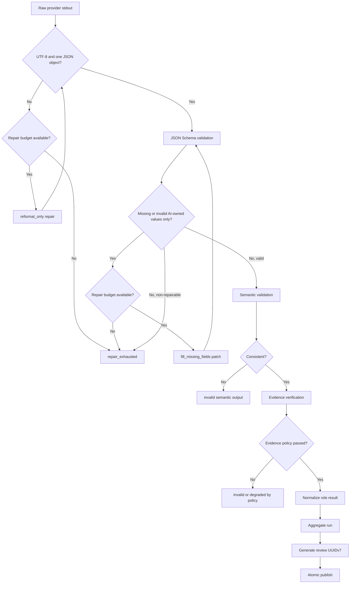

# Output Validation and Repair

## 1. Publication Gate

A provider process exit code of zero is not sufficient to publish a review. KAR applies three deterministic validation stages:

```text
Schema completeness
-> Semantic consistency
-> Evidence verification
```

Only a valid normalized aggregate may become:

```text
.kar/{session_id}/{run_id}/review_{uuidv7}.json
```

## 2. Validation Flow



## 3. Field Ownership

Mandatory keys are divided by ownership.

### 3.1 KAR-owned fields

Examples:

```text
schema_version of final artifact
session_id
run_id
review_id
run_type
created_at
target
selected roles
provider instance
attempt_id
validation status
finding IDs
content_verdict, coverage_status, publication_status, and ci_decision
artifact hashes
```

KAR generates these values from execution state. Missing KAR-owned fields indicate an implementation or artifact failure. They must never be sent to AI for completion.

### 3.2 AI-owned fields

Provider review output requires meaningful values for:

```text
schema_version
summary
completeness
limitations
findings
findings[].severity
findings[].title
findings[].description
findings[].evidence
findings[].recommendation
findings[].confidence
```

Followup output requires meaningful values for:

```text
schema_version
summary
resolution
rationale
evidence
new_findings
```

## 4. JSON Schema Validation

JSON Schema validates:

- required keys;
- object, array, string, integer, and enum types;
- `additionalProperties: false` where specified;
- non-empty strings;
- minimum array sizes;
- numeric bounds;
- schema version constants;
- UUID formats where represented in final artifacts.

Provider schemas:

- [Review output v2](../schemas/kar-provider-review-output.v2.schema.json)
- [Followup output v2](../schemas/kar-provider-followup-output.v2.schema.json)

These schemas validate KAR-normalized envelopes: KAR always injects current target identity and injects immutable source identity only for source-bearing followup, delta, rerun, or equivalent review modes; root review omits `source`. Provider-owned evidence remains a path/range/quote claim with `verification=claimed`. A provider cannot emit a trusted verification state.

A key that exists with `null`, whitespace, a placeholder, or the wrong type does not satisfy the contract.

Default rejected placeholder values, case-insensitive after trim:

```text
N/A
TBD
TODO
unknown
none
-
```

A field-specific schema or semantic rule may explicitly allow `unknown`, but the generic validator does not infer that permission.

## 5. Semantic Validation

JSON Schema cannot express all cross-field rules. KAR applies deterministic semantic checks.

Examples:

| Rule | Result |
|---|---|
| `completeness=incomplete` with an empty limitations array | Invalid |
| `completeness=complete` with a limitation that says material scope was unreadable | Invalid |
| Finding has `line_end < line_start` | Invalid |
| Finding severity is `high` or above without evidence | Invalid |
| Evidence path is absolute or escapes target root | Invalid |
| Followup says `resolved` but rationale states the issue remains | Invalid semantic output |
| Review summary says no findings while findings array is non-empty | Invalid semantic output |
| Duplicate findings from one attempt have identical normalized content | Deduplicate with diagnostic or reject by policy |

Semantic contradiction is not treated as a missing-value repair by default. It requires an exact rerun or fallback after classification.

## 6. Source and Current Evidence Reducers

Provider evidence is a claim. KAR preserves source identity and current verification as separate objects; source evidence can never be presented as current verified evidence.

A source reference requires all of:

```text
session_id
run_id
review_id
finding_id
source_target_sha256
source_excerpt_sha256
```

KAR verifies those fields only against the immutable source captured target and source artifact. `source.source_excerpt_sha256` identifies only the original source excerpt. It cannot satisfy, replace, or be copied as a fallback for a current excerpt digest.

A persisted current reference requires all of:

```text
target_sha256
current_excerpt_sha256
side
path
line_start
line_end
quote
verification
```

`side` is exactly `base`, `head`, or `worktree`. `verification` is exactly `claimed`, `verified`, `stale`, `invalid`, or `unverifiable`. Paths are nonempty UTF-8 NFC relative paths with `/` separators; absolute paths, backslashes, NUL, `.` and `..` segments reject. Lines are positive, one-based, inclusive, and `line_start <= line_end`.

Captured-target lookup is by immutable `target_sha256`, `side`, and path. Line splitting preserves original bytes, recognizes LF, and permits a final non-LF line. The excerpt includes each selected original terminating LF when present:

```text
excerpt_sha256 =
  SHA-256("KAR-EVIDENCE-EXCERPT/1" || 0x00 ||
          raw_target_digest_32 || 0x00 || ASCII(side) || 0x00 ||
          UTF8_NFC(path) || 0x00 || u64be(line_start) || u64be(line_end) ||
          0x00 || excerpt_bytes)
```

A claimed current reference becomes `verified` only on an exact target, range, quote, and `current_excerpt_sha256` match. `current_excerpt_sha256` identifies the newly verified current excerpt and controls indexed excerpt verification and order; it is never derived from or substituted by `source.source_excerpt_sha256`. It becomes `stale` when the source reference is valid but the current target differs or no longer matches; `invalid` for malformed paths, ranges, or a false hash; and `unverifiable` when immutable bytes are unavailable. Source/current spoofing, traversal, inverted or out-of-bounds ranges, stale targets, excerpt mismatches, and missing source bytes are negative cases.

An `invalid` or `unverifiable` provider claim is an evidence-validation failure: it may use one bounded AI-owned repair and then an eligible fallback. A stored artifact or query hash mismatch is an artifact failure (exit `7`), not a repairable provider claim. Human-readable excerpts are created by KAR only after this reducer succeeds and are persisted through the secure writer.

## 7. Repair Budget

Default:

```yaml
validation:
  repair:
    enabled: true
    max_attempts: 1
    same_provider: true
```

One repair attempt is usually sufficient to recover a formatting or omission error without creating an open-ended cost and drift loop. A maximum of two may be configurable, but it should not be the default.

## 8. Repair Modes

### 8.1 `reformat_only`

Used when stdout is not a valid single JSON object.

Repair instruction:

```text
Re-emit the same review content as one valid JSON object matching the schema.
Do not add, remove, merge, downgrade, or reinterpret findings.
Return JSON only.
```

KAR stores original and repaired bytes separately only after the shared secure writer accepts them. A secret match or scan overflow drops the buffered content and prevents its hash or substring from being persisted; it is a security violation, not a repair input. A repaired result still receives full validation because semantic identity cannot be presumed.

### 8.2 `fill_missing_fields`

Used when JSON parses and only explicitly identified AI-owned paths are missing or invalid.

The repair response is a constrained patch:

```json
{
  "schema_version": "kar-repair-patch.v1",
  "repairs": [
    {
      "path": "/findings/0/recommendation",
      "value": "Trigger fallback only for provider execution or invalid-output failures."
    }
  ]
}
```

KAR validates:

- every path appears in `allowed_paths`;
- no existing meaningful value is replaced;
- arrays are not added to, removed from, or reordered unless the requested path is the entire missing field;
- severity, finding count, and evidence identity cannot change unless that exact path was missing and allowed;
- no system-owned field is present;
- the patched candidate passes the complete validation pipeline.

See [repair request example](../examples/repair-request.json) and [repair patch example](../examples/repair-patch.json).

## 9. Repair and Fallback Prohibitions

Repair must not:

- delete or merge findings;
- downgrade severity;
- change the run type, role, or provider identity;
- fabricate session, run, attempt, review, target, source, or current-evidence metadata;
- overwrite an existing non-empty field;
- bypass source/current evidence verification;
- continue after cancellation; or
- convert a security or mutation policy violation into a valid result.

Only invalid JSON and explicitly AI-owned missing or invalid values are eligible for one repair attempt. `timeout`, `auth`, `quota`, and `rate_limit` have `repair=none` and `fallback=allowed`; an eligible configured fallback may then be scheduled. If no fallback is eligible, `fallback_scheduled=false` and the role is exhausted.

Security, source mutation, configuration, artifact, cancellation, internal-invariant, and valid-finding conditions have `fallback=forbidden`. Secret exposure or mutation also forbids repair and publication and returns exit `8`. An exhausted required role preserves valid findings, sets `coverage_status=incomplete`, and returns exit `4` unless a higher-priority failure applies. An exhausted optional role may produce `coverage_status=degraded`; its committed content is retained and trusted CI policy decides exit `0` or `1`.

## 10. Stateless Repair Packet

A provider CLI session may not retain conversation state. The repair request therefore contains:

- provider output schema;
- original candidate or raw output;
- validation errors;
- allowed JSON Pointer paths;
- selected role and run type;
- relevant source excerpts when an evidence field must be supplied;
- explicit prohibition on unrelated changes.

The request must not resend the entire repository when a small verified excerpt is sufficient.

## 11. Validation Artifacts

Each validation round stores:

```text
validation/
  validation.001.json
  repair-request.001.json
  repair-response.001.raw
  repair-patch.001.json
  candidate.repaired.001.json
  validation.002.json
```

Final run-level validation stores:

```text
validation/final-validation.json
```

Example machine contract:

- [Validation result schema](../schemas/kar-validation-result.v2.schema.json)

## 12. Outcome Axes and Finalization

The v2 run and review schemas serialize four independent axes. No axis is derived by deleting or relabeling another:

| Field | Enum | Owner |
|---|---|---|
| `content_verdict` | `no_findings`, `findings_present`, `request_changes` | deterministic aggregation |
| `coverage_status` | `complete`, `degraded`, `incomplete` | coordinator coverage reducer |
| `publication_status` | `not_published`, `staged`, `installed`, `committed`, `corrupt` | publication classifier |
| `ci_decision` | `pass`, `fail` | trusted CI policy |

`content_verdict` describes only validated findings. At the trusted default threshold, any `high`, `critical`, or `blocker` finding yields `request_changes`; findings below that threshold yield `findings_present`; no findings yield `no_findings`. A required-role failure does not erase a valid high finding: `content_verdict=request_changes` and `coverage_status=incomplete` coexist.

`coverage_status=complete` requires every required role to complete with policy-satisfying evidence. `degraded` means no required role is missing but a policy-permitted selected result has material limits or warnings. `incomplete` means a required role has no valid terminal result. Optional exhaustion may be `degraded`; required exhaustion is `incomplete`. Valid content remains serialized for both states.

`persisted_journal_state` is the last fsynced publication hint and is exactly one of:

```text
collecting
content_validated
final_staged
final_file_installed
manifest_committed
completed
```

`derived_publication_status` is recomputed from durable observations and is exactly one of the `publication_status` values above. Serialized `publication_status` and reader authority are derived solely from `derived_publication_status`, never copied from `persisted_journal_state`. The durable P2/P1/P0 classifier and recovery rules are defined in [Artifacts, Lineage, and Storage](08-artifacts-lineage-and-storage.md#13-publication-authority-and-recovery).

`ci_decision` is a trusted-policy projection with reason codes. It does not change `content_verdict`, `coverage_status`, or `publication_status`. A valid `request_changes` can therefore have `ci_decision=fail`; valid optional degraded content can have either decision according to `degraded_review_fails`; incomplete remains exit `4` even if a finding policy would also fail.

## 13. Publication Rule

The final review ID is generated only after selected roles have terminal policy states and final artifact validation passes. A final review may be structurally valid while coverage is incomplete or degraded, but it becomes reader-visible only when the composite publication authority is `P2_COMMITTED` and `publication_status=committed`.

```text
review_id creation
-> serialize final artifact to a same-directory temporary file
-> validate serialized bytes against the final schema
-> fsync the temporary file
-> atomic install at review_{review_id}.json
-> under the store lock, commit manifest + lineage edge + epoch as one composite
-> derive publication status from durable observations
```

A valid P2 recovery returns the stored outcome projection `0`, `1`, or `4`; a crash alone does not return exit `7`. A malformed, partial, ambiguous, or mismatched final is never reader-visible. Target-capture, security, artifact-integrity, cancellation, and internal failures do not produce a misleading final review artifact.