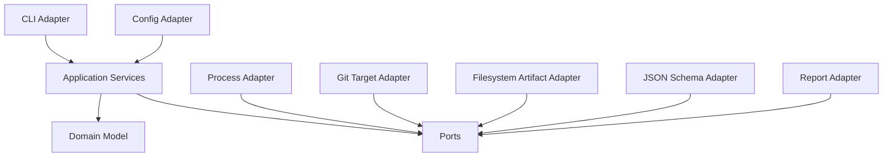

# Go Architecture

## 0. G0 Contract Boundary

This document describes the post-authorization product architecture. G001 completed `g0_complete` and the separate implementation approval; G002–G006 implement the domain/ports, trusted foundation, fake-review, coordinator/runtime/evidence, publication/recovery, reporting, and committed-query boundaries; and G007 completes the authority-gated provider adapters for exactly `kimi`, `zcode`, and `agy`. G008 and G009 remain separately gated and pending.

No coordinator, publisher, provider adapter, lineage service, product tool, actual product/release CI job, or release asset may be implemented before both the authoritative SOT post-verification records `g0_complete` and a separate session-bound implementation approval is granted. Gate A, candidate review, promotion authorization, and the authority-ref compare-and-swap are distinct prerequisites; cached approval data is not authority.

The product boundary uses four independently serialized outcome axes:

| Axis | Canonical enum | Authority |
|---|---|---|
| Content | `no_findings`, `findings_present`, `request_changes` | Deterministic aggregation |
| Coverage | `complete`, `degraded`, `incomplete` | Coordinator |
| Publication | `not_published`, `staged`, `installed`, `committed`, `corrupt` | Artifact store |
| CI | `pass`, `fail`, with reason codes | Trusted CI policy |

A high finding and required-role exhaustion therefore preserve `request_changes` and `incomplete` independently. Publication and CI are not inferred from either value.

The platform inventory retains `linux-amd64`, `linux-arm64`, `darwin-amd64`, and `darwin-arm64`, but only `darwin-arm64` is G0 `required`/blocking and requires native local-POSIX probe evidence. The other three cells are `intended_future`, non-blocking, unsupported, and release-ineligible; Windows and network filesystems are outside this contract. The exact authority-gated `kimi`, `zcode`, and `agy` adapter tuples are complete through G007; standalone absence of evidence remains `UNVERIFIED` and does not imply support. Provider/platform evidence v1 is compatibility-only; only v2 evidence may enter readiness. `codex` and `claude` are optional post-G0 configuration only and are not assignment defaults or automatic fallbacks.

## 0.1 Post-G0 architectural milestones

G1 establishes domain, configuration, target, artifact, command-envelope, and doctor surfaces. G2 adds the fake-provider review slice and prompt compilation. G3 adds coordinator scheduling, validation, repair, evidence, and publication. G4 adds opt-in live provider adapters only after tuple evidence. G5 adds followup, delta, rerun, cleanup, and export. G6 may expand to a future Linux or Intel cell only after a new scope decision, native evidence, candidate refreeze, promotion, and separate implementation approval. These milestones are product work, not G0 evidence.

## 0.2 Authority and persistence boundaries

The application owns business transitions; adapters own untrusted byte ingestion and durable effects. Every newly persisted untrusted byte channel uses the shared scan-before-write boundary before it can enter an artifact, prompt, diagnostic, probe pack, repair record, or export.

Publication separates a persisted journal hint from derived durable state. The only publication authority is a valid P2 composite commit: one canonical final file whose hash matches a committed manifest, lineage edge, and epoch record. P1 installed and P0 staged observations are recovery authority only. Ambiguity, multiplicity, path escape, symlink/non-regular files, absent journal expectations, or composite mismatch derive `corrupt`, produce an immutable diagnostic, and use artifact exit `7`. Recovery applies the precedence `ambiguity/mismatch > P2 > P1 > P0 staged > P0 none hint recovery > corrupt default`; it never adopts ambiguous bytes or rewrites completed source bytes.

## 1. Architectural Style

KAR uses a domain-first, ports-and-adapters architecture. Core domain and application packages do not depend on Cobra, YAML, JSON Schema libraries, Git commands, `os/exec`, or filesystem implementations.



Dependency direction points inward. Adapters implement ports owned by the application or domain boundary.

## 2. Recommended Package Layout

```text
cmd/kar/main.go

internal/domain/
  identifiers.go
  session.go
  run.go
  role_task.go
  attempt.go
  finding.go
  target.go
  policy.go
  errors.go

internal/app/
  start_review.go
  start_followup.go
  start_delta.go
  start_rerun.go
  coordinator.go
  validation_pipeline.go
  aggregation.go
  publication.go
  status_query.go

internal/ports/
  provider_executor.go
  provider_registry.go
  target_capture.go
  artifact_store.go
  prompt_compiler.go
  output_validator.go
  evidence_verifier.go
  report_renderer.go
  clock.go
  id_generator.go
  lane_lock.go

internal/adapters/cli/
internal/adapters/config/
internal/adapters/providerexec/
internal/adapters/providers/
  fake/
  genericjson/
  zcode/
  kimi/
  agy/
  codex/
  claude/
internal/adapters/gittarget/
internal/adapters/filesystem/
internal/adapters/jsonschema/
internal/adapters/report/
internal/adapters/locking/

internal/builtin/prompts/
internal/builtin/schemas/
internal/builtin/help/
```

## 3. Core Domain Rules

Domain constructors and transition methods enforce invariants.

Representative API shape:

```go
type Run struct {
    ID        RunID
    SessionID SessionID
    Type      RunType
    State     RunState
    Roles     []RoleTask
}

func (r *Run) Start() error
func (r *Run) QueuePrimary(role Role) (AttemptSpec, error)
func (r *Run) ApplyAttemptResult(result AttemptResult) ([]DomainEvent, error)
func (r *Run) Complete(policy ReviewPolicy) (ReviewDecision, error)
```

Do not expose public setters for state enums. Invalid transitions return typed invariant errors.

## 4. Ports

### Provider executor

```go
type ProviderExecutor interface {
    Execute(ctx context.Context, spec InvocationSpec) (InvocationResult, error)
}
```

`InvocationResult` contains captured bytes, exit information, timing, and typed failure details for one child process. The application layer aggregates initial and repair invocations into one logical attempt. It does not contain normalized findings.

### Target capture

```go
type TargetCapture interface {
    Capture(ctx context.Context, req TargetRequest) (CapturedTarget, error)
    Delta(ctx context.Context, previous CapturedTargetRef, current TargetRequest) (CapturedTarget, error)
}
```

### Artifact store

```go
type ArtifactStore interface {
    CreateSession(ctx context.Context, session SessionRecord) error
    CreateRun(ctx context.Context, run RunRecord) error
    WriteAttemptArtifact(ctx context.Context, ref AttemptRef, name string, data []byte) error
    ReplaceRunState(ctx context.Context, ref RunRef, state RunStateRecord) error
    PublishReview(ctx context.Context, req PublishReviewRequest) (PublishedReview, error)
    SealRun(ctx context.Context, ref RunRef, manifest RunManifest) error
}
```

`PublishReview` owns temporary file creation, final schema validation, atomic rename, SHA-256 calculation, and manifest-safe return values.

### Validator

```go
type OutputValidator interface {
    ValidateProviderReview(ctx context.Context, raw []byte, scope ValidationScope) ValidationResult
    ValidateProviderFollowup(ctx context.Context, raw []byte, scope ValidationScope) ValidationResult
    ValidateFinalReview(ctx context.Context, raw []byte) ValidationResult
}
```

A validation implementation returns diagnostics. It should not panic on provider input.

## 5. Coordinator Design

The coordinator is a single logical owner of run transitions. It may use goroutines internally but serializes domain event application.

Suggested model:

```text
coordinator event loop
  input: attempt completed, repair completed, cancellation, timeout, artifact failure
  state: run aggregate and open lane queues
  output: queue attempt, request repair, cancel attempts, finalize run
```

This avoids:

- `WaitGroup.Add` after `Wait` races;
- closing a lane before dynamic fallback is scheduled;
- multiple components deciding terminal state;
- fallback after cancellation;
- nondeterministic role result selection.

## 6. Lane Worker Model

One worker exists per active concurrency key. A lane receives immutable `InvocationSpec` values and returns immutable invocation results.

```go
type Lane struct {
    Key      ConcurrencyKey
    Queue    <-chan InvocationSpec
    Results  chan<- InvocationResult
    Executor ProviderExecutor
    Lock     LaneLock
}
```

The lane does not mutate `Run` directly.

## 7. Error Taxonomy

Use typed errors or error codes that preserve stage and fallback eligibility.

```go
type FailureClass string

const (
    FailureProviderUnavailable FailureClass = "provider_unavailable"
    FailureInvalidOutput      FailureClass = "invalid_provider_output"
    FailureTimeout            FailureClass = "timeout"
    FailureAuthentication     FailureClass = "auth"
    FailureQuota              FailureClass = "quota"
    FailureRateLimit          FailureClass = "rate_limit"
    FailureSecurityPolicy     FailureClass = "security_policy_violation"
    FailureConfiguration      FailureClass = "configuration_violation"
    FailureArtifact           FailureClass = "artifact_failure"
    FailureInternal           FailureClass = "kar_internal_error"
    FailureCancelled          FailureClass = "user_cancelled"
)
```

Fallback eligibility is a policy function over typed failures, not string matching on error text. `timeout`, `auth`, `quota`, and `rate_limit` have `repair=none` and `fallback=allowed`; if no eligible configured fallback exists, the role is exhausted without changing that eligibility. Invalid provider output receives its single constrained repair before an eligible fallback. Security, mutation, configuration, artifact, cancellation, internal invariant, and valid findings forbid fallback.

## 8. Serialization Boundary

Domain structs should not double as persistence structs. Versioned adapter DTOs translate between domain and JSON/YAML contracts.

Benefits:

- schema version migration does not pollute domain logic;
- internal types can use stronger Go representations;
- persistence rejects unknown fields independently;
- sensitive fields can be omitted or redacted by adapters;
- final artifact construction remains explicit.

## 9. Deterministic Dependencies

Inject:

```text
Clock
UUIDv7 generator
monotonic sequence generator
filesystem
process executor
Git target capture
lane lock
```

Tests must not depend on wall-clock sleeps, random UUIDs, live Git state, or installed providers.

## 10. Built-In Assets

Embed versioned prompts, schemas, and help using `go:embed`. Every asset has a stable ID, for example:

```text
builtin:prompts/common@1
builtin:roles/security@1
builtin:schemas/provider-review-output@1
builtin:help/security@1
```

The prompt manifest records exact IDs and SHA-256 values.

## 11. CLI Adapter

The CLI layer handles:

- parsing and help;
- locating project root;
- loading config through the config adapter;
- constructing application requests;
- rendering concise progress and final status;
- mapping application results to exit codes.

It must not implement scheduling, fallback, validation, target capture, or publication logic.

## 12. Schema Evolution

Version strings are explicit:

```text
kar-provider-review-output.v1           compatibility reader only
kar-provider-followup-output.v1         compatibility reader only
kar-review-artifact.v1                  compatibility reader only
kar-run-manifest.v1                     compatibility reader only
kar-provider-review-output.v2           G0 execution contract
kar-provider-followup-output.v2         G0 execution contract
kar-review-artifact.v2                  G0 publication contract
kar-run-manifest.v2                     G0 publication contract
kar-provider-contract-evidence.v1       compatibility-only; never readiness authority
kar-platform-contract-evidence.v1       compatibility-only; never readiness authority
kar-provider-contract-evidence.v2       family evidence readiness authority
kar-platform-contract-evidence.v2       platform evidence readiness authority
```

Within a major schema version, additions require careful `additionalProperties` policy and backward-compatible readers. Breaking field or semantic changes require a new schema version and migration/read compatibility plan.
